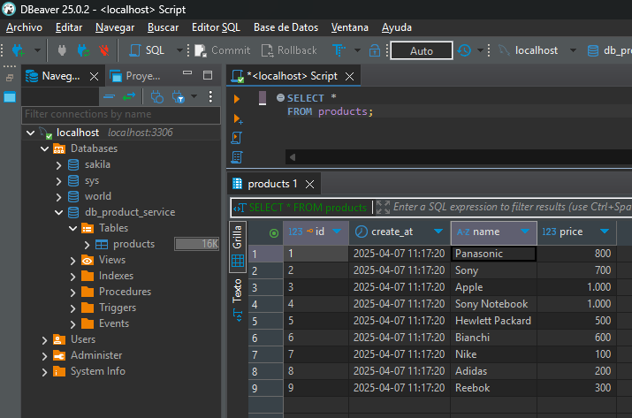

# Sección 02: Comenzando con los microservicios

---

## Creando nuestro microservicio products

Iniciamos creando el `product-service` desde
[Spring Initializr](https://start.spring.io/#!type=maven-project&language=java&platformVersion=3.4.4&packaging=jar&jvmVersion=21&groupId=dev.magadiflo&artifactId=product-service&name=product-service&description=Product%20Service%20Project&packageName=dev.magadiflo.product.app&dependencies=web,data-jpa,lombok,mysql,cloud-starter)
con las siguientes dependencias.

````xml
<!--Spring Boot 3.4.4-->
<!--Java 21-->
<!--Spring Cloud Version 2024.0.1-->
<dependencies>
    <dependency>
        <groupId>org.springframework.boot</groupId>
        <artifactId>spring-boot-starter-data-jpa</artifactId>
    </dependency>
    <dependency>
        <groupId>org.springframework.boot</groupId>
        <artifactId>spring-boot-starter-web</artifactId>
    </dependency>
    <dependency>
        <groupId>org.springframework.cloud</groupId>
        <artifactId>spring-cloud-starter</artifactId>
    </dependency>

    <dependency>
        <groupId>com.mysql</groupId>
        <artifactId>mysql-connector-j</artifactId>
        <scope>runtime</scope>
    </dependency>
    <dependency>
        <groupId>org.projectlombok</groupId>
        <artifactId>lombok</artifactId>
        <optional>true</optional>
    </dependency>
    <dependency>
        <groupId>org.springframework.boot</groupId>
        <artifactId>spring-boot-starter-test</artifactId>
        <scope>test</scope>
    </dependency>
</dependencies>
````

**Nota**
> En `spring initializr` agregamos la dependencia `Cloud Bootstrap` simplemente para que desde el principio tengamos la
> versión de `Spring Cloud`.

**Importante**
> Cada versión de `Spring Boot` tiene su correspondiente versión específica de `Spring Cloud`.

Configuramos el `application.yml` del `product-service` con las siguientes propiedades:

````yml
server:
  port: 8001
  error:
    include-message: always

spring:
  application:
    name: product-service
````

## Añadiendo la clase Entity JPA

Creamos la entidad `Product` con anotaciones de `jpa`. Además, nos apoyamos de las anotaciones de `Lombok` para evitar
el boilerplate (código repetitivo).

````java

@ToString
@AllArgsConstructor
@NoArgsConstructor
@Builder
@Getter
@Setter
@Entity
@Table(name = "products")
public class Product {
    @Id
    @GeneratedValue(strategy = GenerationType.IDENTITY)
    private Long id;
    private String name;
    private BigDecimal price;
    private LocalDateTime createAt;
}
````

## Creando el repositorio JPA con Spring Data JPA

En el microservicio `product-service`, creamos el repositorio `ProductRepository` para la entidad `Product`.

````java
public interface ProductRepository extends CrudRepository<Product, Long> {
}
````

## Creando el Servicio para la lógica de negocio

En este apartado crearemos la capa de servicio para nuestro `product-service`, pero para eso, necesitamos crear
clases de utilidades adicionales.

Empezamos creando la clase dto para mapear la información que se envía al endpoint.

````java
public record ProductRequest(String name,
                             BigDecimal price) {
}
````

El dto que nos permitirá enviar información a través de los endpoints.

````java
public record ProductResponse(Long id,
                              String name,
                              BigDecimal price,
                              LocalDateTime createAt) {
}
````

También es necesario crear una clase donde almacenaremos las distintas constantes para todo lo relacionado con
productos.

````java

@UtilityClass
public class ProductConstant {
    public static final String NO_SUCH_ELEMENT_MESSAGE = "The product with id %d does not exist";
}
````

**Importante**
> La anotación `@UtilityClass`:<br>
> - Hace la clase final (no se puede extender).<br>
> - Agrega un constructor privado, para que no se pueda instanciar.<br>
> - Convierte todos los métodos y campos en static.<br>

Una clase importante es la clase de utilidad que nos permitirá mapear nuestra entidad a un dto y viceversa. Según la
información proporcionada por Chat-GPT, es mejor definir esta clase de utilidad como un `@Component` dado que estamos
trabajando con Spring Boot, además Spring promueve trabajar con `instancias` y `beans` para favorecer la flexibilidad y
el testing. Podría haber optado por hacer la clase con método estáticos, es decir, usar la anotación de `Lombok` como
el `@UtilityClass`, pero según la recomendación es mejor hacerlo como un componente de spring.

````java

@Component
public class ProductMapper {

    public ProductResponse toProductResponse(Product product) {
        return new ProductResponse(product.getId(), product.getName(), product.getPrice(), product.getCreateAt());
    }

    public Product toProduct(ProductRequest request) {
        return Product.builder()
                .name(request.name())
                .price(request.price())
                .createAt(LocalDateTime.now().truncatedTo(ChronoUnit.SECONDS))
                .build();
    }

    public Product toUpdateProduct(Product productDB, ProductRequest request) {
        productDB.setName(request.name());
        productDB.setPrice(request.price());
        return productDB;
    }
}
````

**Donde**

`LocalDateTime.now().truncatedTo(ChronoUnit.SECONDS)`, esta instrucción obtiene la fecha y hora actual del sistema
`(LocalDateTime.now())`, pero truncada a nivel de segundos, eliminando cualquier precisión menor (como milisegundos,
microsegundos y nanosegundos).

**¿Por qué se utiliza?**

- Para evitar diferencias de precisión entre el valor generado en la aplicación y el valor realmente almacenado en la
  base de datos (por ejemplo, `MySQL` suele almacenar solo hasta microsegundos).
- Para mantener un formato uniforme de fecha y hora en los registros `(yyyy-MM-ddTHH:mm:ss)`.
- Facilita la comparación de fechas y mejora la legibilidad de los datos.
- Ejemplo: `LocalDateTime.now().truncatedTo(ChronoUnit.SECONDS); //2025-04-07T11:49:16`

Finalmente, implementamos la clase de servicio del producto.

````java

@Slf4j
@RequiredArgsConstructor
@Service
@Transactional(readOnly = true)
public class ProductServiceImpl implements ProductService {

    private final ProductMapper productMapper;
    private final ProductRepository productRepository;

    @Override
    public List<ProductResponse> findProducts() {
        return ((List<Product>) this.productRepository.findAll()).stream()
                .map(this.productMapper::toProductResponse)
                .toList();
    }

    @Override
    public ProductResponse findProduct(Long productId) {
        return this.productRepository.findById(productId)
                .map(this.productMapper::toProductResponse)
                .orElseThrow(() -> new NoSuchElementException(ProductConstant.NO_SUCH_ELEMENT_MESSAGE.formatted(productId)));
    }

    @Override
    @Transactional
    public ProductResponse saveProduct(ProductRequest request) {
        Product productDB = this.productRepository.save(this.productMapper.toProduct(request));
        return this.productMapper.toProductResponse(productDB);
    }

    @Override
    @Transactional
    public ProductResponse updateProduct(Long productId, ProductRequest request) {
        return this.productRepository.findById(productId)
                .map(productDB -> this.productMapper.toUpdateProduct(productDB, request))
                .map(this.productRepository::save)
                .map(this.productMapper::toProductResponse)
                .orElseThrow(() -> new NoSuchElementException(ProductConstant.NO_SUCH_ELEMENT_MESSAGE.formatted(productId)));
    }

    @Override
    @Transactional
    public void deleteProduct(Long productId) {
        Product productDB = this.productRepository.findById(productId)
                .orElseThrow(() -> new NoSuchElementException(ProductConstant.NO_SUCH_ELEMENT_MESSAGE.formatted(productId)));
        this.productRepository.deleteById(productDB.getId());
    }
}
````

**Importante:<br>
[The best way to use the Spring Transactional annotation](https://vladmihalcea.com/spring-transactional-annotation/)**

> Notar que estamos definiendo la anotación `@Transactional(readOnly = true)` al nivel de clase, lo que significa que,
> por defecto, todos los métodos de servicio usarán esta configuración y se ejecutarán en una transacción de solo
> lectura, a menos que el método anule la configuración transaccional con su propia definición de `@Transactional`, tal
> como se ve en los métodos `saveProduct(), updateProduct() y deleteProduct()`.

## Creando el controlador Rest

Creamos el controlador para nuestro `product-service`.

````java

@Slf4j
@RequiredArgsConstructor
@RestController
@RequestMapping(path = "/api/v1/products")
public class ProductController {

    private final ProductService productService;

    @GetMapping
    public ResponseEntity<List<ProductResponse>> findProducts() {
        return ResponseEntity.ok(this.productService.findProducts());
    }

    @GetMapping(path = "/{productId}")
    public ResponseEntity<ProductResponse> findProduct(@PathVariable Long productId) {
        return ResponseEntity.ok(this.productService.findProduct(productId));
    }

    @PostMapping
    public ResponseEntity<ProductResponse> saveProduct(@RequestBody ProductRequest productRequest) {
        ProductResponse productResponse = this.productService.saveProduct(productRequest);
        URI location = URI.create("/api/v1/products/%d".formatted(productResponse.id()));
        return ResponseEntity.created(location).body(productResponse);
    }

    @PutMapping(path = "/{productId}")
    public ResponseEntity<ProductResponse> updateProduct(@PathVariable Long productId, @RequestBody ProductRequest productRequest) {
        return ResponseEntity.ok(this.productService.updateProduct(productId, productRequest));
    }

    @DeleteMapping(path = "/{productId}")
    public ResponseEntity<Void> deleteProduct(@PathVariable Long productId) {
        this.productService.deleteProduct(productId);
        return ResponseEntity.noContent().build();
    }
}
````

## Configurando conexión a MySQL en el application.yml

En el `application.yml` del `product-service` agregamos las siguientes configuraciones.

````yml
server:
  port: 8001
  error:
    include-message: always

spring:
  application:
    name: product-service
  datasource:
    url: jdbc:mysql://localhost:3306/db_product_service?serverTimezone=America/Lima
    username: root
    password: magadiflo
  jpa:
    hibernate:
      ddl-auto: update
    properties:
      hibernate:
        format_sql: true
    defer-datasource-initialization: true
  sql:
    init:
      mode: always

logging:
  level:
    org.hibernate.SQL: debug
````

Además, para poblar la tabla `products` en la base de datos, vamos a crear un archivo llamado `data.sql` en el
`/resources`. El contenido del script será el siguiente:

````sql
TRUNCATE TABLE products;
ALTER TABLE products AUTO_INCREMENT = 1;

INSERT INTO products(id, name, price, create_at)
VALUES(1, 'Panasonic', 800, NOW()),
(2, 'Sony', 700, NOW()),
(3, 'Apple', 1000, NOW()),
(4, 'Sony Notebook', 1000, NOW()),
(5, 'Hewlett Packard', 500, NOW()),
(6, 'Bianchi', 600, NOW()),
(7, 'Nike', 100, NOW()),
(8, 'Adidas', 200, NOW()),
(9, 'Reebok', 300, NOW());
````

Observar que estamos usando el `ALTER TABLE` al inicio del script para reiniciar la tabla. Esto lo hacemos, porque
cada vez que iniciemos la aplicación, en la tabla aparezcan siempre los mismos registros.

Como vamos a apoyarnos del archivo `data.sql` para poblar la tabla `products`, es que en las configuraciones anteriores
hemos agregado las que se muestran a continuación.

````yml
spring:
  jpa:
    defer-datasource-initialization: true
  sql:
    init:
      mode: always
````

[Guía rápida sobre cómo cargar datos iniciales con Spring Boot](https://www.baeldung.com/spring-boot-data-sql-and-schema-sql)

- `spring.jpa.defer-datasource-initialization=true`, evita que el `data.sql` se ejecute antes de que hibernate cree las
  tablas, digamos que retrasa esa ejecución.
- `spring.sql.init.mode=always`, permite la inicialización basada en scripts, es decir, insertar datos a través de
  `data.sql` o crear un esquema a través de `schema.sql`.

## Probando la conexión a MySQL (crea la BBDD y tabla)

Creamos la base de datos llamada `db_product_service` utilizando `DBeaver`.


Luego de dar en `Aceptar`, ejecutamos la aplicación. Hibernate, será quien cree la tabla `products` gracias las
anotaciones que definimos en la entidad `Product`. Luego, nuestro script `data.sql` será ejecutada poblando la tabla
`products`.

A continuación se muestra los logs que aparecen en IntelliJ IDEA al ejecutar nuestra aplicación.

````bash
  .   ____          _            __ _ _
 /\\ / ___'_ __ _ _(_)_ __  __ _ \ \ \ \
( ( )\___ | '_ | '_| | '_ \/ _` | \ \ \ \
 \\/  ___)| |_)| | | | | || (_| |  ) ) ) )
  '  |____| .__|_| |_|_| |_\__, | / / / /
 =========|_|==============|___/=/_/_/_/

 :: Spring Boot ::                (v3.4.4)

2025-04-07T11:17:15.046-05:00  INFO 19144 --- [product-service] [           main] d.m.p.app.ProductServiceApplication      : Starting ProductServiceApplication using Java 21.0.6 with PID 19144 (D:\programming\spring\01.udemy\02.andres_guzman\06.microservices_netflix_eureka\microservices-project\business-domain\product-service\target\classes started by magadiflo in D:\programming\spring\01.udemy\02.andres_guzman\06.microservices_netflix_eureka\microservices-project)
2025-04-07T11:17:15.050-05:00  INFO 19144 --- [product-service] [           main] d.m.p.app.ProductServiceApplication      : No active profile set, falling back to 1 default profile: "default"
...
2025-04-07T11:17:16.102-05:00  INFO 19144 --- [product-service] [           main] .s.d.r.c.RepositoryConfigurationDelegate : Finished Spring Data repository scanning in 69 ms. Found 1 JPA repository interface.
2025-04-07T11:17:16.267-05:00  INFO 19144 --- [product-service] [           main] o.s.cloud.context.scope.GenericScope     : BeanFactory id=ea0cfd3b-8b8c-3869-9338-662393805086
2025-04-07T11:17:16.836-05:00  INFO 19144 --- [product-service] [           main] o.s.b.w.embedded.tomcat.TomcatWebServer  : Tomcat initialized with port 8001 (http)
...
2025-04-07T11:17:16.854-05:00  INFO 19144 --- [product-service] [           main] o.apache.catalina.core.StandardEngine    : Starting Servlet engine: [Apache Tomcat/10.1.39]
...
2025-04-07T11:17:17.311-05:00  INFO 19144 --- [product-service] [           main] org.hibernate.Version                    : HHH000412: Hibernate ORM core version 6.6.11.Final
...
2025-04-07T11:17:17.734-05:00  INFO 19144 --- [product-service] [           main] o.s.o.j.p.SpringPersistenceUnitInfo      : No LoadTimeWeaver setup: ignoring JPA class transformer
2025-04-07T11:17:17.779-05:00  INFO 19144 --- [product-service] [           main] com.zaxxer.hikari.HikariDataSource       : HikariPool-1 - Starting...
2025-04-07T11:17:18.216-05:00  INFO 19144 --- [product-service] [           main] com.zaxxer.hikari.pool.HikariPool        : HikariPool-1 - Added connection com.mysql.cj.jdbc.ConnectionImpl@51cca357
2025-04-07T11:17:18.218-05:00  INFO 19144 --- [product-service] [           main] com.zaxxer.hikari.HikariDataSource       : HikariPool-1 - Start completed.
2025-04-07T11:17:18.315-05:00  INFO 19144 --- [product-service] [           main] org.hibernate.orm.connections.pooling    : HHH10001005: Database info:
	Database JDBC URL [Connecting through datasource 'HikariDataSource (HikariPool-1)']
	Database driver: undefined/unknown
	Database version: 8.0.41
	Autocommit mode: undefined/unknown
	Isolation level: undefined/unknown
	Minimum pool size: undefined/unknown
	Maximum pool size: undefined/unknown
2025-04-07T11:17:19.214-05:00  INFO 19144 --- [product-service] [           main] o.h.e.t.j.p.i.JtaPlatformInitiator       : HHH000489: No JTA platform available (set 'hibernate.transaction.jta.platform' to enable JTA platform integration)
2025-04-07T11:17:19.255-05:00 DEBUG 19144 --- [product-service] [           main] org.hibernate.SQL                        : 
    create table products (
        id bigint not null auto_increment,
        create_at datetime(6),
        name varchar(255),
        price decimal(38,2),
        primary key (id)
    ) engine=InnoDB
2025-04-07T11:17:19.282-05:00  INFO 19144 --- [product-service] [           main] j.LocalContainerEntityManagerFactoryBean : Initialized JPA EntityManagerFactory for persistence unit 'default'
2025-04-07T11:17:19.728-05:00  WARN 19144 --- [product-service] [           main] JpaBaseConfiguration$JpaWebConfiguration : spring.jpa.open-in-view is enabled by default. Therefore, database queries may be performed during view rendering. Explicitly configure spring.jpa.open-in-view to disable this warning
2025-04-07T11:17:20.234-05:00  INFO 19144 --- [product-service] [           main] o.s.b.w.embedded.tomcat.TomcatWebServer  : Tomcat started on port 8001 (http) with context path '/'
2025-04-07T11:17:20.252-05:00  INFO 19144 --- [product-service] [           main] d.m.p.app.ProductServiceApplication      : Started ProductServiceApplication in 5.956 seconds (process running for 6.848)
````

Si revisamos la tabla `products` vemos que se han poblado sin problemas con los datos colocados en el `data.sql`.



## Probando nuestra API products

- Listar todos los productos

````bash
$ curl -v http://localhost:8001/api/v1/products | jq
>
< HTTP/1.1 200
< Content-Type: application/json
< Transfer-Encoding: chunked
< Date: Mon, 07 Apr 2025 16:36:21 GMT
<
[
  {
    "id": 1,
    "name": "Panasonic",
    "price": 800.00,
    "createAt": "2025-04-07T11:30:27"
  },
  {...},
  {
    "id": 9,
    "name": "Reebok",
    "price": 300.00,
    "createAt": "2025-04-07T11:30:27"
  }
]
````

- Buscar un producto

````bash
$ curl -v http://localhost:8001/api/v1/products/5 | jq
>
< HTTP/1.1 200
< Content-Type: application/json
< Transfer-Encoding: chunked
< Date: Mon, 07 Apr 2025 16:40:07 GMT
<
{
  "id": 5,
  "name": "Hewlett Packard",
  "price": 500.00,
  "createAt": "2025-04-07T11:30:27"
}
````

- Guardar un producto

````bash
$ curl -v -X POST -H "Content-Type: application/json" -d "{\"name\": \"Auricular Halio\", \"price\": 60}" http://localhost:8001/api/v1/products | jq
>
< HTTP/1.1 201
< Location: /api/v1/products/10
< Content-Type: application/json
< Transfer-Encoding: chunked
< Date: Mon, 07 Apr 2025 17:03:51 GMT
<
{
  "id": 10,
  "name": "Auricular Halio",
  "price": 60,
  "createAt": "2025-04-07T12:03:51"
}
````

- Editar un producto

````bash
$ curl -v -X PUT -H "Content-Type: application/json" -d "{\"name\": \"Auricular Halio Wireless\", \"price\": 90.50}" http://localhost:8001/api/v1/products/10 | jq
>
< HTTP/1.1 200
< Content-Type: application/json
< Transfer-Encoding: chunked
< Date: Mon, 07 Apr 2025 17:05:14 GMT
<
{
  "id": 10,
  "name": "Auricular Halio Wireless",
  "price": 90.50,
  "createAt": "2025-04-07T12:03:51"
}
````

- Eliminar un producto

````bash
$ curl -v -X DELETE http://localhost:8001/api/v1/products/10 | jq
>
< HTTP/1.1 204
< Date: Mon, 07 Apr 2025 17:06:05 GMT
<
````

## Crea el microservicio item-service

Iniciamos creando nuestro proyecto desde
[Spring Initlizr](https://start.spring.io/#!type=maven-project&language=java&platformVersion=3.4.4&packaging=jar&jvmVersion=21&groupId=dev.magadiflo&artifactId=item-service&name=item-service&description=Item%20Service%20Project&packageName=dev.magadiflo.item.app&dependencies=web,lombok,cloud-starter,cloud-feign)
con las siguientes dependencias:

````xml
<!--Spring Boot 3.4.4-->
<!--Java 21-->
<!--Spring Cloud Version 2024.0.1-->
<dependencies>
    <dependency>
        <groupId>org.springframework.boot</groupId>
        <artifactId>spring-boot-starter-web</artifactId>
    </dependency>
    <dependency>
        <groupId>org.springframework.cloud</groupId>
        <artifactId>spring-cloud-starter</artifactId>
    </dependency>
    <dependency>
        <groupId>org.springframework.cloud</groupId>
        <artifactId>spring-cloud-starter-openfeign</artifactId>
    </dependency>

    <dependency>
        <groupId>org.projectlombok</groupId>
        <artifactId>lombok</artifactId>
        <optional>true</optional>
    </dependency>
    <dependency>
        <groupId>org.springframework.boot</groupId>
        <artifactId>spring-boot-starter-test</artifactId>
        <scope>test</scope>
    </dependency>
</dependencies>
````

En el `application.yml` del `item-service` agregamos las siguientes configuraciones:

````yml
server:
  port: 8002
  error:
    include-message: always

spring:
  application:
    name: item-service
````

## Creando clase Model Product e Item

En nuestro `item-serivice` creamos nuestro dto `Product`, con los mismos atributos que nos retorna el endpoint del
`product-service`.

````java
public record Product(Long id,
                      String name,
                      BigDecimal price,
                      LocalDateTime createAt) {
}
````

Ahora, crearemos un dto llamado `Item`, que tendrá como campos, el dto `Product` y la cantidad.

````java
public record Item(Product product, int quantity) {
    public BigDecimal total() {
        return product.price().multiply(BigDecimal.valueOf(quantity));
    }
}
````

Importante, notar que estamos trabajando con `records`, es una forma de trabajar en java para crear los dtos. En este
record, vamos a agregar un método que nos retorne el producto del precio por la cantidad.

Antes de finalizar este apartado, vamos a crear una interfaz donde definiremos dos métodos para retornar los items o un
item en específico a partir del id del producto.

````java
public interface ItemService {
    List<Item> findItems();

    Item findItemByProductId(Long productId);
}
````

## Implementando Client Http con OpenFeign

En este apartado configuraremos el `Feign Client` en nuestro `item-service` para realizar peticiones hacia el
`product-service`.

Como primer paso, debemos anotar con `@EnableFeignClients` nuestra clase principal para habilitar el uso de este cliente
en nuestra aplicación.

````java

@EnableFeignClients
@SpringBootApplication
public class ItemServiceApplication {

    public static void main(String[] args) {
        SpringApplication.run(ItemServiceApplication.class, args);
    }

}
````

A continuación, creamos la interfaz `ProductFeignClient` donde definiremos los distintos métodos que serán construídos
por debajo para la realización de peticiones hacia el microservicio de productos.

````java

@FeignClient(name = "product-service", url = "127.0.0.1:8001", path = "/api/v1/products")
public interface ProductFeignClient {
    @GetMapping
    List<Product> findProducts();

    @GetMapping(path = "/{productId}")
    Product findProduct(@PathVariable Long productId);
}
````

`@FeignClient`, anotación para interfaces que declara la creación de un cliente REST con dicha interfaz (p. ej.,
la conexión automática a otro componente). Si SC LoadBalancer está disponible, se usará para equilibrar la carga de las
solicitudes del backend. El balanceador de carga puede configurarse con el mismo nombre (es decir, valor) que el
cliente de feign.
