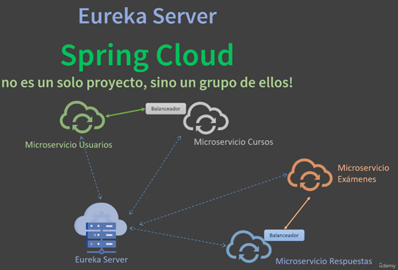
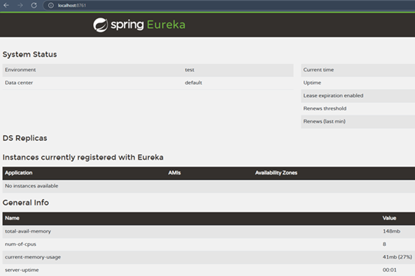
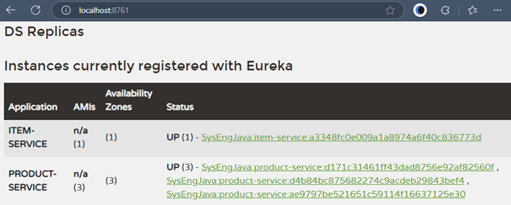

# Sección 03: Eureka Server Registrando microservicios

---

## Introducción a Eureka

Es una herramienta que sirve para el registro y descubrimiento de servicios. Fue inicialmente creada por `Netflix` y
diseñada para arquitecturas de microservicios.

La principal ventaja de `Eureka Server` es que elimina la necesidad de que los microservicios conozcan de antemano las
ubicaciones de otros servicios con los que necesitan interactuar. En lugar de esto, se registran en `Eureka` y otros
servicios los consultan allí cuando los necesitan. De esta manera `Eureka` resuelve uno de los principales problemas de
las arquitecturas de microservicios: `la localización dinámica de servicios`.

Veamos un poco más a fondo sus ventajas:

- `Registro dinámico`: Cada microservicio se registra automáticamente en el servidor.
- `Balanceo de carga`: Al trabajar en conjunto con otros componentes como `Spring Cloud LoadBalancer`, permite
  distribuir las solicitudes entre las distintas instancias de un microservicio.
- `Tolerancia a fallos`: Si un servicio falla o deja de enviar `«heartbeats»` (señales de vida) al servidor,
  `Eureka Server` lo elimina del registro automáticamente, esto nos ayuda a evitar fallos en cadena.
- `Escalabilidad`: Facilita la escalabilidad horizontal, lo que a su vez permite que nuevos servicios se añadan o
  retiren sin problemas.



## [Creando servidor de registro Eureka](https://start.spring.io/#!type=maven-project&language=java&platformVersion=3.4.4&packaging=jar&jvmVersion=21&groupId=dev.magadiflo&artifactId=discovery-server&name=discovery-server&description=Discovery%20Server&packageName=dev.magadiflo.discovery.server.app&dependencies=cloud-eureka-server)

Creamos nuestro proyecto únicamente con la dependencia de `Spring Cloud Eureka Server`.

````xml
<!--Spring Boot 3.4.4-->
<!--Spring Cloud Version 2024.0.1-->
<!--Java 21-->
<dependencies>
    <dependency>
        <groupId>org.springframework.cloud</groupId>
        <artifactId>spring-cloud-starter-netflix-eureka-server</artifactId>
    </dependency>
</dependencies>
````

Para habilitar esta aplicación como un servidor de eureka debemos agregar la anotación `@EnableEurekaServer` en la clase
principal.

````java

@EnableEurekaServer
@SpringBootApplication
public class DiscoveryServerApplication {

    public static void main(String[] args) {
        SpringApplication.run(DiscoveryServerApplication.class, args);
    }

}
````

A continuación debemos configurar el `application.yml`.

````yml
server:
  port: 8761
  error:
    include-message: always

spring:
  application:
    name: discovery-server

eureka:
  instance:
    hostname: localhost
  client:
    register-with-eureka: false
    fetch-registry: false
    service-url:
      defaultZone: http://${eureka.instance.hostname}:${server.port}/eureka/
````

Ahora, si levantamos el `discovery-server` podremos ver su dashboard en la dirección `http://localhost:8761`.



## Conectando nuestros servicios como clientes Eureka

En este apartado haremos que nuestro `product-service` e `item-service` sean clientes del servidor de `Eureka`. Pero
para eso, primero quitaremos las dependencias y configuraciones que hicimos anteriormente con respecto al
`loadBalancer`. Esto lo hacemos porque ahora trabajaremos con `Eureka` y `Eureka` ya trae internamente la dependencia
de `spring-cloud-starter-loadbalancer`.

Luego de tener limpio el proyecto `item-service`, vamos a agregar la dependencia de `Eureka Client` en el `pom.xml`
tanto en el `product-service` como en el `item-service`.

````xml

<dependency>
    <groupId>org.springframework.cloud</groupId>
    <artifactId>spring-cloud-starter-netflix-eureka-client</artifactId>
</dependency>
````

Ahora, en el `product-service` agregaremos la siguiente configuración. Aquí cada vez que se levante una aplicación se
registrará en eureka una instancia de este servicio cuyo id será lo que se obtenga en ese `instance-id`. Además,
agregamos el `defaultZone` que corresponde a la dirección donde está corriendo el servidor de `Eureka`.

````yml
eureka:
  instance:
    prefer-ip-address: true
    instance-id: ${spring.cloud.client.hostname}:${spring.application.name}:${random.value}
  client:
    service-url:
      defaultZone: http://localhost:8761/eureka/
````

**Dónde**

- Si `eureka.instance.prefer-ip-address=true`, `Eureka` registrará la dirección IP de la máquina que está ejecutando la
  aplicación, en lugar de su nombre de host. Esto puede ser útil cuando se ejecutan múltiples instancias en una red y no
  se quiere depender del nombre del host para acceder al servicio.

    - En nuestro ejemplo, con `prefer-ip-address: true`, `Eureka` registrará las instancias del microservicio utilizando
      la dirección IP de la máquina en lugar de `localhost` o el `nombre del host` (el puerto puede ser generado de
      manera manual o con el `server.port=0` de manera aleatoria al levantar cada instancia del microservicio). Por
      ejemplo:
      ````
      http://192.168.1.100:8010 (primera instancia)
      http://192.168.1.100:8011 (segunda instancia)
      http://192.168.1.100:8012 (tercera instancia)
      ````
    - `Importante`: esas URLs son lo que otros servicios verán en `Eureka` para acceder al microservicio.
    - El valor predeterminado de `prefer-ip-address` es `false`. Esto significa que, `Eureka` registrará las instancias
      utilizando el `nombre del host`, y cuando está configurado como `true`, usará la `dirección IP`.


- `eureka.instance.instance-id`, es un identificador único para que cada instancia del microservicio se registre de
  forma distinta en `Eureka`. Eso evita que una instancia sobrescriba a otra. Entonces, esta configuración:

    - Define un identificador único de la instancia dentro de Eureka.
    - Esto evita que las instancias se sobreescriban.
    - Con tu configuración: `${spring.cloud.client.hostname}:${spring.application.name}:${random.value}` se generan
      identificadores como:
        - `localhost:product-service:0.12345678`
        - `localhost:product-service:0.98654321`
    - Esto ayuda a distinguirlas dentro del panel de Eureka y a nivel de control y monitoreo.

Mientras que en el `item-service`, además de haber agregado la misma configuración que la anterior, necesitamos cambiar
el esquema `http://` que estaba definido anteriormente por el esquema `lb://`, ya que como dijimos, si se usa un
servidor de descubrimiento como `Eureka`, se puede utilizar una URL lógica con el esquema `lb://`, por ejemplo:
`baseUrl("lb://product-service/api/v1/products")`. En este caso, el nombre del servicio (`product-service`)
será resuelto por el servidor de descubrimiento (`Eureka`).

A continuación se muestra las configuraciones completas del `item-service` definidos en su `application.yml`.

````yml
server:
  port: 8002
  error:
    include-message: always

spring:
  application:
    name: item-service

eureka:
  instance:
    prefer-ip-address: true
    instance-id: ${spring.cloud.client.hostname}:${spring.application.name}:${random.value}
  client:
    service-url:
      defaultZone: http://localhost:8761/eureka/

custom:
  base-url:
    product-service: lb://product-service/api/v1/products
````

## Probando Servidor Eureka + microservicios

Si levantamos el servidor de `Eureka` junto a los microservicios `product-service` e `item-service`, veremos en el
dashboard que estos microservicios se han registrado correctamente. Observemos que hemos levantado 3 instancias del
`product-service` y una instancia del `item-service`.



Ahora, procedemos a realizar las peticiones y a observar qué instancia está respondiendo.

````bash
curl -v -G --data "quantity=10" http://localhost:8002/api/v1/items/1 | jq
>
< HTTP/1.1 200
< Content-Type: application/json
< Transfer-Encoding: chunked
< Date: Tue, 08 Apr 2025 22:26:35 GMT
<
{
  "product": {
    "id": 1,
    "name": "Panasonic",
    "price": 800.00,
    "createAt": "2025-04-08T17:21:54",
    "port": 53004
  },
  "quantity": 10,
  "total": 8000.00
}
````

````bash
$ curl -v -G --data "quantity=10" http://localhost:8002/api/v1/items/1 | jq
>
< HTTP/1.1 200
< Content-Type: application/json
< Transfer-Encoding: chunked
< Date: Tue, 08 Apr 2025 22:27:58 GMT
<
{ [136 bytes data]
100   130    0   130    0     0    930      0 --:--:-- --:--:-- --:--:--   984
* Connection #0 to host localhost left intact
{
  "product": {
    "id": 1,
    "name": "Panasonic",
    "price": 800.00,
    "createAt": "2025-04-08T17:21:54",
    "port": 53021
  },
  "quantity": 10,
  "total": 8000.00
}
````

````bash
$ curl -v -G --data "quantity=10" http://localhost:8002/api/v1/items/1 | jq
>
< HTTP/1.1 200
< Content-Type: application/json
< Transfer-Encoding: chunked
< Date: Tue, 08 Apr 2025 22:28:10 GMT
<
{
  "product": {
    "id": 1,
    "name": "Panasonic",
    "price": 800.00,
    "createAt": "2025-04-08T17:21:54",
    "port": 52988
  },
  "quantity": 10,
  "total": 8000.00
}
````

Como observamos en las peticiones anteriores, en cada una de ellas nos está respondiendo con un puerto distinto.
Recordar que cuando levantamos una instancia del `product-service`, este se va a levantar con un puerto aleatorio
gracias a la configuración que agregamos `server.port=0`.

