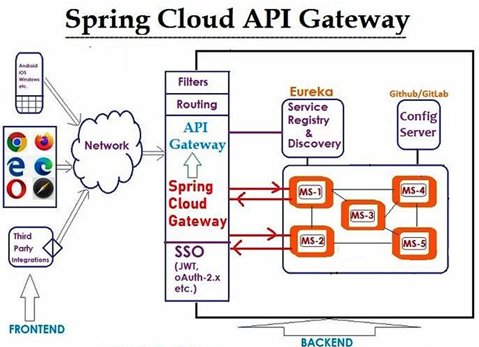

# Sección 04: Spring Cloud Gateway

---

## Introducción a Spring Cloud Gateway

`Spring Cloud Gateway` busca proporcionar una forma sencilla y eficaz de enrutar las API y abordar cuestiones
transversales como la seguridad, la monitorización/métricas y la resiliencia.

Características de `Spring Cloud Gateway`:

- Desarrollado en Spring Framework 5, Project Reactor y Spring Boot 2.0
- Capacidad para conectar rutas con cualquier atributo de solicitud.
- Los predicados y filtros son específicos de cada ruta.
- Integración con Hystrix Circuit Breaker.
- Integración con Spring Cloud DiscoveryClient.
- Fácil escritura de predicados y filtros.
- Limitación de la tasa de solicitudes.
- Reescritura de rutas.



## [Creando servicio Spring Cloud Gateway](https://start.spring.io/#!type=maven-project&language=java&platformVersion=3.4.4&packaging=jar&jvmVersion=21&groupId=dev.magadiflo&artifactId=gateway-server&name=gateway-server&description=Gateway%20Server&packageName=dev.magadiflo.gateway.server.app&dependencies=cloud-gateway-reactive,cloud-eureka,lombok)

Las dependencias usadas para crear el Gateway serán los siguientes:

````xml
<!--Spring Boot 3.4.4-->
<!--Spring Cloud 2024.0.1-->
<!--Java 21-->
<dependencies>
    <dependency>
        <groupId>org.springframework.cloud</groupId>
        <artifactId>spring-cloud-starter-gateway</artifactId>
    </dependency>
    <dependency>
        <groupId>org.springframework.cloud</groupId>
        <artifactId>spring-cloud-starter-netflix-eureka-client</artifactId>
    </dependency>

    <dependency>
        <groupId>org.projectlombok</groupId>
        <artifactId>lombok</artifactId>
        <optional>true</optional>
    </dependency>
    <dependency>
        <groupId>org.springframework.boot</groupId>
        <artifactId>spring-boot-starter-test</artifactId>
        <scope>test</scope>
    </dependency>
    <dependency>
        <groupId>io.projectreactor</groupId>
        <artifactId>reactor-test</artifactId>
        <scope>test</scope>
    </dependency>
</dependencies>
````

En el `application.yml` agregamos las siguientes configuraciones.

````yml
server:
  port: 8090
  error:
    include-message: always

spring:
  application:
    name: gateway-server

eureka:
  instance:
    prefer-ip-address: true
  client:
    service-url:
      defaultZone: http://localhost:8761/eureka/
````
