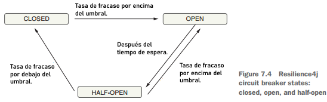

# Sección 05: Resilience4j (Resiliencia y tolerancia a fallos)

---

## Introducción a Circuit Breaker (cortocircuito)

El patrón `Circuit Breaker` es una técnica de diseño para manejar fallos en sistemas distribuidos, como los
microservicios, y `Resilience4j` es una biblioteca que implementa este patrón en Java.

Un `Circuit Breaker` (o interruptor de circuito) es un patrón de diseño que protege un sistema de fallos repetidos. Su
funcionamiento es muy similar a un interruptor eléctrico:

1. `Cerrado (Closed)`: Cuando el sistema está funcionando correctamente, el interruptor está cerrado y las solicitudes
   pasan normalmente.

2. `Abierto (Open)`: Si se detectan fallos repetidos (por ejemplo, un servicio no responde), el interruptor se abre y
   las solicitudes no se envían al servicio. En su lugar, el sistema puede devolver una respuesta predeterminada o
   realizar una acción alternativa.

3. `Semi-abierto (Half-Open)`: Después de un periodo de tiempo, el `Circuit Breaker` permite algunas solicitudes de
   prueba (de forma controlada) para ver si el servicio ha recuperado su estabilidad. Si estas solicitudes tienen éxito,
   el circuito se cierra completamente; si fallan, el circuito se abre de nuevo.



## Resilience4j

`Resilience4j` es una librería ligera que permite implementar este patrón en Java, y tiene muchas características
útiles como:

- `Circuit Breaker`: Maneja fallos de servicios externos.
- `Rate Limiter`: Limita la cantidad de solicitudes por unidad de tiempo.
- `Retry`: Vuelve a intentar operaciones fallidas.
- `Bulkhead`: Limita el daño de fallos a una parte del sistema.
- `TimeLimiter`: Limita el tiempo de ejecución de operaciones asíncronas.

## Parámetros del Circuit Breaker

- `slidingWindowSize (100)`, el tamaño de la ventana deslizante es por defecto de 100 peticiones. Es decir, se va a
  trabajar con base en 100 solicitudes para determinar la taza de fallos y éxitos.
- `failureRateThreshold(50)`, representa el porcentaje de falla, es el umbral de fallos que por defecto es del `50%`. Es
  decir, si de los 100 request (`slidingWindowSize`) fallan el 50%, entonces se abre el cortocircuito `OPEN`. Después de
  60 segundos (por defecto) pasa al estado semiabierto `HALF_OPEN`. Estando en estado semiabierto realiza peticiones de
  prueba para verificar si el servicio sigue fallando o ya no, de esa forma ver si se regresa a `OPEN` o pasa a
  `CLOSED`.
- `waitDurationInOpenState (60000ms)`, tiempo de duración en el que permanece en estado `OPEN`, por defecto es de 60
  segundos (60000ms).
- `permittedNumberOfCallsInHalfOpenState(10)`, número permitido de llamadas en estado `HALF_OPEN`, por defecto, son 10.
  Ahora, si el porcentaje de fallas en este estado `HALF_OPEN` supera el 50% (`failureRateThreshold`) entonces seguimos
  en estado `OPEN`, pero si las fallas son menores al 50%, entonces se consiera que es momento de regresar al estado
  `CLOSED`. Por ejemplo, si de las 10 llamadas, 2 son de fallo y 8 son de éxito, entonces se pasa al estado `CLOSED`, ya
  que es mayor al 50% la tasa de éxito.
- `slowCallRateThreshold(100)`, umbral cuando la llamada es lenta.
- `slowCallDurationThreshold(60000ms)`, se considera que una llamada es lenta si tiene esta duración de 60000ms.

## Configurando microservicio items con Resilience4j

Para ver el funcionamiento del `Resilience4j` desde nuestro `item-service` necesitamos modificar el `product-service`
para simular comportamientos cuando se hagan llamadas a ese microservicio.

### En el product-service

En nuestro `product-service` crearemos una nueva constante llamada `ILLEGAL_STATE_EXCEPTION`.

````java

@UtilityClass
public class ProductConstant {
    public static final String NO_SUCH_ELEMENT_MESSAGE = "The product with id %d does not exist";
    public static final String ILLEGAL_STATE_EXCEPTION = "Hay un error con el producto con id %d";
}
````

En el manejador de excepciones del `product-service`, capturamos la excepción `IllegalStateException` que será el que
enviemos al cliente cuando ocurra un error simulado al estar probando el `circuit breaker`.

````java

@RestControllerAdvice
public class GlobalExceptionHandler {

    @ExceptionHandler(NoSuchElementException.class)
    public ResponseEntity<ErrorResponse> apiException(NoSuchElementException exception, HttpServletRequest request) {
        ErrorResponse error = new ErrorResponse(HttpStatus.NOT_FOUND.value(), HttpStatus.NOT_FOUND.getReasonPhrase(), exception.getMessage(), request.getRequestURI());
        return ResponseEntity.status(HttpStatus.NOT_FOUND).body(error);
    }

    @ExceptionHandler(IllegalStateException.class)
    public ResponseEntity<ErrorResponse> apiException(IllegalStateException exception, HttpServletRequest request) {
        ErrorResponse error = new ErrorResponse(HttpStatus.BAD_REQUEST.value(), HttpStatus.BAD_REQUEST.getReasonPhrase(), exception.getMessage(), request.getRequestURI());
        return ResponseEntity.status(HttpStatus.BAD_REQUEST).body(error);
    }

    @ExceptionHandler(Exception.class)
    public ResponseEntity<ErrorResponse> apiException(Exception exception, HttpServletRequest request) {
        ErrorResponse error = new ErrorResponse(HttpStatus.INTERNAL_SERVER_ERROR.value(), HttpStatus.INTERNAL_SERVER_ERROR.getReasonPhrase(), exception.getMessage(), request.getRequestURI());
        return ResponseEntity.status(HttpStatus.INTERNAL_SERVER_ERROR).body(error);
    }
}
````

En el controlador del `product-service` agregamos condicionales para que en función del valor del `productId` lancemos
una `excepción` o simulemos un `timeout`.

````java

@Slf4j
@RequiredArgsConstructor
@RestController
@RequestMapping(path = "/api/v1/products")
public class ProductController {

    private final ProductService productService;

    /* code */

    @GetMapping(path = "/{productId}")
    public ResponseEntity<ProductResponse> findProduct(@PathVariable Long productId) throws InterruptedException {
        if (productId.equals(10L)) {
            throw new IllegalStateException(ProductConstant.ILLEGAL_STATE_EXCEPTION.formatted(productId));
        }

        if (productId.equals(5L)) {
            TimeUnit.SECONDS.sleep(5);
        }
        return ResponseEntity.ok(this.productService.findProduct(productId));
    }

    /* code */
}
````

### En el item-service

Ahora, en el `item-service` agregamos la dependencia del `Resilience4j`.

````xml

<dependency>
    <groupId>org.springframework.cloud</groupId>
    <artifactId>spring-cloud-starter-circuitbreaker-resilience4j</artifactId>
</dependency>
````

En el controlador del `item-service` inyectamos el `CircuitBreakerFactory` que luego será utilizado en el endpoint
`findProduct()`. La respuesta que enviemos al cliente será envuelta en el `CircuitBreakerFactory` inyectado, de tal
manera que, si la llamada que se hace con `this.itemService.findItemByProductId(productId, quantity)` al microservicio
de productos es exitosa, se regresa el `ResponseEntity.ok` con el objeto obtenido. En caso de que ocurra un fallo en la
llamada, pues se ejecutará el siguiente parámetro del `run()` que es una función `fallback`, es decir, como camino
alternativo al ocurrir la falla se ejecutará dicha función que en nuestro caso es regresar un `ResponseEntity.ok(item)`.

````java

@Slf4j
@RestController
@RequestMapping(path = "/api/v1/items")
public class ItemController {

    private final ItemService itemService;
    private final CircuitBreakerFactory circuitBreakerFactory;

    public ItemController(@Qualifier("itemServiceWithRestClientImpl") ItemService itemService,
                          CircuitBreakerFactory circuitBreakerFactory) {
        this.itemService = itemService;
        this.circuitBreakerFactory = circuitBreakerFactory;
    }

    /* code */

    @GetMapping(path = "/{productId}")
    public ResponseEntity<Item> findProduct(@PathVariable Long productId, @RequestParam int quantity) {
        Product product = new Product(0L, "Producto respaldo", BigDecimal.ZERO, LocalDateTime.now(), 0);
        Item item = new Item(product, 1);

        return this.circuitBreakerFactory
                .create("items")        //1
                .run(
                        () -> {         //2
                            log.info("Llamando al product-service");
                            return ResponseEntity.ok(this.itemService.findItemByProductId(productId, quantity));
                        },
                        throwable -> {  //3
                            log.warn("Error cuando se llamó al product-service, se envía información alternativa");
                            return ResponseEntity.ok(item);
                        }
                );
    }
}
````

`CircuitBreakerFactory` es una fábrica de circuit breakers que provee `Spring Cloud Circuit Breaker`. Te permite crear y
personalizar circuit breakers de forma programática, sin necesidad de usar anotaciones como `@CircuitBreaker`. Muy útil
cuando quieres más control o necesitas diferentes comportamientos en distintos puntos de tu código.

1. `create("items")`

- Crea un `Circuit Breaker` con nombre `items`.
- Este nombre debe estar relacionado con tu configuración en el `application.yml` (donde defines cosas como
  `failureRateThreshold`, `slidingWindowSize`, etc.).
- Si no lo configuras explícitamente, usará los valores por defecto.

2. `run(Supplier<T> runnable, Function<Throwable, T> fallback)`

- `Primer parámetro`: lo que quieres que se intente ejecutar (la lógica principal).
- `Segundo parámetro`: una función de fallback que se ejecuta si:
    - El circuito está en estado `OPEN`.
    - La lógica principal lanza una excepción.

3. `Fallback (throwable -> {...})`

- Si por ejemplo `product-service` está caído o responde con error, este bloque se ejecuta.
- En tu ejemplo, se devuelve un producto de respaldo `("Producto respaldo")`.

#### Ventajas de usar CircuitBreakerFactory así

- Puedes manejar errores más detalladamente sin depender del manejo automático por anotaciones.
- Ideal para personalizar diferentes fallbacks, por ejemplo, dependiendo del tipo de error o el circuito.
- Muy útil cuando tu lógica está fuera del alcance de los AOP (como métodos privados o lambdas).

## Probando Resilience con los criterios por defecto

### 55 request con errores

A continuación vamos a probar los criterios por defecto del `Circuit Breaker`. Iniciaremos enviando unos `55 request`
con el `productId = 10`, de tal forma que el `product-service` nos lanzará errores. Ahora, como nuestro `item-service`
está haciendo uso del `Circuit Breaker` como alternativa nos devolverá el objeto estático que le definimos.

````bash
$ curl -v -G --data "quantity=10" http://localhost:8090/api/v1/items/10 | jq
>
< HTTP/1.1 200 OK
< transfer-encoding: chunked
< Content-Type: application/json
< Date: Thu, 10 Apr 2025 21:54:53 GMT
< token-response: 123456
< X-Response-color: green
< set-cookie: color=red
<
{
  "product": {
    "id": 0,
    "name": "Producto respaldo",
    "price": 0,
    "createAt": "2025-04-10T16:54:53.8747217",
    "port": 0
  },
  "quantity": 1,
  "total": 0
}
````

### 45 request con éxito

Ahora realizamos unos `45 request` con respuesta exitosa

````bash
$ curl -v -G --data "quantity=10" http://localhost:8090/api/v1/items/1 | jq
>
< HTTP/1.1 200 OK
< transfer-encoding: chunked
< Content-Type: application/json
< Date: Thu, 10 Apr 2025 22:02:59 GMT
< token-response: 123456
< X-Response-color: green
< set-cookie: color=red
<
{
  "product": {
    "id": 1,
    "name": "Panasonic",
    "price": 800.00,
    "createAt": "2025-04-10T16:50:03",
    "port": 52336
  },
  "quantity": 10,
  "total": 8000.00
}
````

### Request 101 muestra el Circuit Breaker abierto

La siguiente petición corresponde al `request #101`, pero como respuesta estamos obteniendo el objeto de respaldo a
pesar de que el producto con `id = 1` es correcto. Esto está ocurriendo porque se ha evaluado de los `100 request` (# de
request por defecto), `55 han fallado` y `45 han sido exitoso`, por lo tanto, la tasa de fallo es superior al `50%`, por
eso es que el `Circuit Breaker` pasó al estado `OPEN` y en vez de devolvernos un error, también nos devuelve un valor
alternativo.

````bash
$ curl -v -G --data "quantity=10" http://localhost:8090/api/v1/items/1 | jq
>
< HTTP/1.1 200 OK
< transfer-encoding: chunked
< Content-Type: application/json
< Date: Thu, 10 Apr 2025 22:04:51 GMT
< token-response: 123456
< X-Response-color: green
< set-cookie: color=red
<
{
  "product": {
    "id": 0,
    "name": "Producto respaldo",
    "price": 0,
    "createAt": "2025-04-10T17:04:51.4119986",
    "port": 0
  },
  "quantity": 1,
  "total": 0
}
````

Durante `1 minuto`, cuando el estado del `Circuit Breaker` esté en estado `OPEN` y a pesar de que el request sea válido,
estaremos recibiendo como respuesta el camino alternativo.

Cuando pase el `1 minuto` volveremos al estado `SEMI ABIERTO` y ahora estaremos probando sobre `#10 request` como base y
ya no sobre `100`.

### 7 request con errores

````bash
$ curl -v -G --data "quantity=10" http://localhost:8090/api/v1/items/10 | jq
>
< HTTP/1.1 200 OK
< transfer-encoding: chunked
< Content-Type: application/json
< Date: Thu, 10 Apr 2025 22:14:46 GMT
< token-response: 123456
< X-Response-color: green
< set-cookie: color=red
<
{
  "product": {
    "id": 0,
    "name": "Producto respaldo",
    "price": 0,
    "createAt": "2025-04-10T17:14:46.4685058",
    "port": 0
  },
  "quantity": 1,
  "total": 0
}
````

### 3 request con éxito

````bash
$ curl -v -G --data "quantity=10" http://localhost:8090/api/v1/items/1 | jq
>
< HTTP/1.1 200 OK
< transfer-encoding: chunked
< Content-Type: application/json
< Date: Thu, 10 Apr 2025 22:15:37 GMT
< token-response: 123456
< X-Response-color: green
< set-cookie: color=red
<
{
  "product": {
    "id": 1,
    "name": "Panasonic",
    "price": 800.00,
    "createAt": "2025-04-10T16:50:03",
    "port": 52336
  },
  "quantity": 10,
  "total": 8000.00
}
````

### Request #11, el Circuit Breaker se mantiene en estado abierto

Hasta este momento la tasa de errores en este estado `SEMI ABIERTO` es más del `50%`, por lo tanto, el siguiente
request que es el `request #11` nos retornará el objeto alternativo manteniéndose el estado en `OPEN`.

````bash
$ curl -v -G --data "quantity=10" http://localhost:8090/api/v1/items/1 | jq
>
< HTTP/1.1 200 OK
< transfer-encoding: chunked
< Content-Type: application/json
< Date: Thu, 10 Apr 2025 22:18:45 GMT
< token-response: 123456
< X-Response-color: green
< set-cookie: color=red
<
{
  "product": {
    "id": 0,
    "name": "Producto respaldo",
    "price": 0,
    "createAt": "2025-04-10T17:18:45.6915877",
    "port": 0
  },
  "quantity": 1,
  "total": 0
}
````

Durante `1 minuto`, cuando el estado del `Circuit Breaker` esté en estado `OPEN` y a pesar de que el request sea válido,
estaremos recibiendo como respuesta el camino alternativo.

Cuando pase el `1 minuto` volveremos al estado `SEMI ABIERTO` y ahora seguiremos probando sobre `#10 request` como base.
Supongamos que ahora hacemos más del `50% de éxito`.

### 2 request con errores

````bash
$ curl -v -G --data "quantity=10" http://localhost:8090/api/v1/items/10 | jq
>
< HTTP/1.1 200 OK
< transfer-encoding: chunked
< Content-Type: application/json
< Date: Thu, 10 Apr 2025 22:25:11 GMT
< token-response: 123456
< X-Response-color: green
< set-cookie: color=red
<
{
  "product": {
    "id": 0,
    "name": "Producto respaldo",
    "price": 0,
    "createAt": "2025-04-10T17:25:11.987164",
    "port": 0
  },
  "quantity": 1,
  "total": 0
}
````

### 8 request con éxito

````bash
$ curl -v -G --data "quantity=10" http://localhost:8090/api/v1/items/1 | jq
>
< HTTP/1.1 200 OK
< transfer-encoding: chunked
< Content-Type: application/json
< Date: Thu, 10 Apr 2025 22:25:35 GMT
< token-response: 123456
< X-Response-color: green
< set-cookie: color=red
<
{
  "product": {
    "id": 1,
    "name": "Panasonic",
    "price": 800.00,
    "createAt": "2025-04-10T16:50:03",
    "port": 52336
  },
  "quantity": 10,
  "total": 8000.00
}
````

### Request #11, el Circuit Breaker pasa al estado CLOSED

Como se hicieron `2 request con errores` y `8 request con éxito`, la tasa de errores es menor del `50%` por lo tanto,
el `Circuit Breaker` pasa al estado `CLOSED` (flujo normal).

````bash
$ curl -v -G --data "quantity=10" http://localhost:8090/api/v1/items/1 | jq
>
< HTTP/1.1 200 OK
< transfer-encoding: chunked
< Content-Type: application/json
< Date: Thu, 10 Apr 2025 22:26:15 GMT
< token-response: 123456
< X-Response-color: green
< set-cookie: color=red
<
{
  "product": {
    "id": 1,
    "name": "Panasonic",
    "price": 800.00,
    "createAt": "2025-04-10T16:50:03",
    "port": 52336
  },
  "quantity": 10,
  "total": 8000.00
}
````

## Personalizando parámetros del Circuit Breaker

En el apartado anterior hicimos pruebas con la configuración por defecto que viene en el `Circuit Breaker`. En este
apartado personalizaremos esas configuraciones con nuevos valores para los parámetros. Para eso, crearemos una clase
de configuración donde definiremos programáticamente los nuevos valores para el `Circuit Breaker`.

````java

@Slf4j
@Configuration
public class ResilienceConfig {

    @Bean
    public Customizer<Resilience4JCircuitBreakerFactory> customizerCircuitBreaker() {
        return factory -> factory.configureDefault(circuitBreakerId -> {
            log.info("Configurando circuit breaker: {}", circuitBreakerId);

            return new Resilience4JConfigBuilder(circuitBreakerId)
                    .circuitBreakerConfig(CircuitBreakerConfig.custom()
                            .slidingWindowSize(10)
                            .failureRateThreshold(50)
                            .waitDurationInOpenState(Duration.ofSeconds(10L))
                            .permittedNumberOfCallsInHalfOpenState(5)
                            .build())
                    .build();
        });
    }
}
````

**Donde**

- `slidingWindowSize(10)`, tamaño de la ventana deslizante ahora será de `10 request` (será nuestro 100%). Recordar que
  por defecto se trabajaba con `100 request`.
- `failureRateThreshold(50)`, umbral de tasa de fallas será del `50%`.
- `waitDurationInOpenState(Duration.ofSeconds(10L))`, duración de espera en estado `OPEN` será de `10 segundos`.
  Recordar que por defecto era de `1 minuto`.
- `permittedNumberOfCallsInHalfOpenState(5)`, número de llamadas permitidas en estado `SEMI ABIERTO`, serán de
  `5 request`. Es decir, que en ese estado ahora los `5 request` serán nuestro `100%`, lo que significa que al tener un
  `failureRateThreshold(50)` si se tiene 3 fallas de 5, seguirá en estado `OPEN`.

**Importante**
> En esta línea del código anterior `factory.configureDefault(circuitBreakerId -> {...}` el `circuitBreakerId` es el
> identificador que le damos a nuestro `Circuit Breaker`. En ese sentido, si vamos al `ItemController`, veremos en el
> método `findProduct()` la creación del `Circuit Breaker` de la siguiente manera:
> `this.circuitBreakerFactory.create("items").run(...);`, en ese caso el id de ese `Circuit Breaker` es `items`.
>
> Esto es muy importante tenerlo en cuenta, ya que con ese identificador podemos configurar los parámetros como el
> tamaño de la ventana deslizante, umbral de tasa de fallas, tiempo de espera en estado abierto, etc. de esa forma
> sobreescribimos los criterios que por defecto trae el `Circuit Breaker`.
>
> Todos los circuit breaker que tengamos en la aplicación pasarán por ese factory como id, pero como solo tenemos uno
> creado llamado `items`, obviamente solo ese se está pasando y se está configurando.

