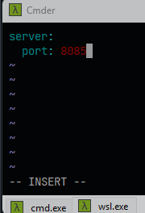
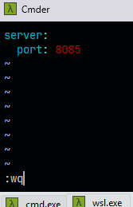

# Sección 06: Spring Cloud Config Server - Centralizando la configuración

---

## Creando el servidor de configuración

Creamos el proyecto `config-server` desde
[Spring Initializr](https://start.spring.io/#!type=maven-project&language=java&platformVersion=3.4.4&packaging=jar&jvmVersion=21&groupId=dev.magadiflo&artifactId=config-server&name=config-server&description=Config%20Server&packageName=dev.magadiflo.config.server.app&dependencies=actuator,cloud-config-server)
con las siguientes dependencias.

````xml
<!--Spring Boot 3.4.4-->
<!--Spring Cloud Version 2024.0.1-->
<!--Java 21-->
<dependencies>
    <dependency>
        <groupId>org.springframework.boot</groupId>
        <artifactId>spring-boot-starter-actuator</artifactId>
    </dependency>
    <dependency>
        <groupId>org.springframework.cloud</groupId>
        <artifactId>spring-cloud-config-server</artifactId>
    </dependency>

    <dependency>
        <groupId>org.springframework.boot</groupId>
        <artifactId>spring-boot-starter-test</artifactId>
        <scope>test</scope>
    </dependency>
</dependencies>
````

Habilitamos el proyecto `config-server` como un servidor de configuraciones agregando la anotación `@EnableConfigServer`
en la clase principal.

````java

@EnableConfigServer
@SpringBootApplication
public class ConfigServerApplication {
    public static void main(String[] args) {
        SpringApplication.run(ConfigServerApplication.class, args);
    }
}
````

En el `application.yml` agregamos las siguientes configuraciones.

````yml
server:
  port: 8888
  error:
    include-message: always

spring:
  application:
    name: config-server
  cloud:
    config:
      server:
        git:
          uri: file:///D:/programming/spring/01.udemy/02.andres_guzman/06.microservices_netflix_eureka/config-server-repo
````

- `spring.cloud.config.server.git.uri`, le estamos diciendo al servidor que busque los archivos de configuración en un
  repositorio `Git local`. Usar `file:///` es totalmente válido durante el desarrollo, y apunta a una carpeta local que
  simula el repositorio.


- `En Sistemas Unix (Linux/Mack)`, las rutas se escriben con una sola barra normal `/`. Por ejemplo
  `file:/Users/config`.


- `En windows`, las rutas se escriben con 3 barras. Por ejemplo: `file:///D:/programming/config`.

Esa ruta debe contener archivos `.properties` o `.yml` con nombres similares a cómo se muestra a continuación, que es
como el `config server` busca los archivos.

> `nombre-aplicacion.yml` o `nombre-aplicacion-profile.yml`

## Crea archivo de configuración en repositorio local

En nuestro directorio del repositorio local crearemos el archivo `item-service.yml` correspondiente al nombre del
microservicio `item-service`. Las configuraciones que agreguemos en este archivo se aplicarán a dicho microservicio por
eso es importante seguir la convención al nombrar el archivo.

Estoy trabajando en windows, pero como para practicar el uso de `linux` es que también trabajaré con `wsl` con una
distribución de `linux` instalada, en mi caso `Ubuntu`. Se puede seguir este apartado que es la creación del archivo
`item-service.yml` agregando cierta configuración, simplemente haciendo uso de algún editor en windows y crearlo
manualmente como cualquier archivo, pero en mi caso, haré uso de esta forma como para ir practicando linux.

Así que, si listo las distribuciones wsl que tengo instaladas,
veremos los siguientes:

````bash
D:\programming\spring\01.udemy\02.andres_guzman\06.microservices_netflix_eureka\config-server-repo
$ wsl -l -v
  NAME              STATE           VERSION
* Ubuntu            Running         2
  docker-desktop    Stopped         2
````

Como se observa, tengo `Ubuntu` como distribución por defecto, así que si escribo `wsl` en la ruta donde estoy
posicionado, mi terminal se posicionará dentro de esa distribución en esa misma ruta.

````bash
D:\programming\spring\01.udemy\02.andres_guzman\06.microservices_netflix_eureka\config-server-repo
λ wsl
magadiflo@SysEngJava:/mnt/d/programming/spring/01.udemy/02.andres_guzman/06.microservices_netflix_eureka/config-server-repo$
````

Ahora, creo el archivo `item-service.yml` y listo el directorio para ver que fue creado.

````bash
magadiflo@SysEngJava:/mnt/d/programming/spring/01.udemy/02.andres_guzman/06.microservices_netflix_eureka/config-server-repo$ touch item-service.yml
magadiflo@SysEngJava:/mnt/d/programming/spring/01.udemy/02.andres_guzman/06.microservices_netflix_eureka/config-server-repo$ ls -l
total 0
-rwxrwxrwx 1 magadiflo magadiflo 0 Apr 14 11:27 item-service.yml
````

Para editar el archivo desde la terminal, usaré el comando `vim`.

````bash
magadiflo@SysEngJava:/mnt/d/programming/spring/01.udemy/02.andres_guzman/06.microservices_netflix_eureka/config-server-repo$ vim item-service.yml
````

Luego se nos abrirá en la misma terminal el editor `vim`. Presionamos `i` (`INSERT`) para agregar contenido al archivo.



Si ya hemos terminado de agregar contenido al archivo, presionamos `ESC` y escribimos `:wq` (write, quit) más `Enter`.



Verificamos el contenido del archivo `item-service.yml`.

````bash
magadiflo@SysEngJava:/mnt/d/programming/spring/01.udemy/02.andres_guzman/06.microservices_netflix_eureka/config-server-repo$ cat item-service.yml
server:
  port: 8085
````

## Creando el repositorio local y realizando commit

Agregamos una configuración adicional al `item-service.yml` ubicado en el repositorio local.

````yml
server:
  port: 8085

custom:
  text: item-service.yml en config server con perfil por defecto
````

A continuación, lo que haremos será inicializar el repositorio local con `git init`. Luego, lo agregamos al `staging`
para finalmente crear nuestro primer commit.

````bash
magadiflo@SysEngJava:/mnt/d/programming/spring/01.udemy/02.andres_guzman/06.microservices_netflix_eureka/config-server-repo$ git init
magadiflo@SysEngJava:/mnt/d/programming/spring/01.udemy/02.andres_guzman/06.microservices_netflix_eureka/config-server-repo$ git add .
magadiflo@SysEngJava:/mnt/d/programming/spring/01.udemy/02.andres_guzman/06.microservices_netflix_eureka/config-server-repo$ git commit -m "Agrega configuraciones para item-service.yml"
magadiflo@SysEngJava:/mnt/d/programming/spring/01.udemy/02.andres_guzman/06.microservices_netflix_eureka/config-server-repo$ git lg
* cf10bee (HEAD -> main) Agrega configuraciones para item-service.yml
````

## Prioridad de configuración entre el Config Server y el microservicio

Cuando usamos Spring Cloud Config Server, la configuración de los archivos application.properties o application.yml se
maneja de la siguiente forma:

1. `Fusión de propiedades`, las propiedades definidas dentro del `microservicio`
   `(application.properties o application.yml)` se combinan con las que vienen del `Config Server`.


2. `Prioridad de sobrescritura`, si una misma propiedad existe tanto en el `microservicio` como en el `Config Server`,
   entonces tendrá prioridad la del `Config Server`. Es decir, la configuración remota sobrescribe la local.


3. `Propiedades adicionales`, si hay propiedades que solo existen en uno de los dos lados, entonces se mantienen y se
   complementan. No se eliminan ni anulan entre sí.

#### Ejemplo práctico

Supongamos que tenemos en el `application.yml` del microservicio:

````yml
server:
  port: 8081
miapp:
  modo: local
````

Y en el archivo remoto `config-server-repo/miapp-dev.yml` tenemos:

````yml
server:
  port: 9090
miapp:
  mensaje: "Desde el config server"
````

El resultado final de las propiedades será:

````yml
server:
  port: 9090                          # Esta fue sobrescrita por el Config Server
miapp:
  modo: local                         # Esta viene del microservicio
  mensaje: "Desde el config server"   # Esta viene del Config Server
````

> La configuración del `Config Server` tiene prioridad sobre la `configuración local`. Si hay conflicto, gana el
> servidor. Si no hay conflicto, se combinan.

## Conectando servicio items al servidor de configuraciones

El `config-server` lee las configuraciones desde el `repositorio Git local` especificado en su `application.yml`, por lo
que podemos acceder a estas configuraciones a través de las `URLs` expuestas por el servidor.

Una vez que tenemos nuestro `Config Server` en ejecución, podemos acceder a las configuraciones de nuestros
microservicios mediante una URL con el siguiente formato:

> `http://<host>:<puerto>/<nombre-del-servicio>/<perfil>`

A continuación, accedemos a las configuraciones del `item-service` con perfil `default`.

````bash
$ curl -v http://localhost:8888/item-service/default | jq
>
< HTTP/1.1 200
< Content-Type: application/json
< Transfer-Encoding: chunked
< Date: Mon, 14 Apr 2025 17:14:38 GMT
<
{
  "name": "item-service",
  "profiles": [
    "default"
  ],
  "label": null,
  "version": "cf10bee2d84f342a8679c428f3a38fc0a5b40424",
  "state": "",
  "propertySources": [
    {
      "name": "file:///D:/programming/spring/01.udemy/02.andres_guzman/06.microservices_netflix_eureka/config-server-repo/item-service.yml",
      "source": {
        "server.port": 8085,
        "custom.text": "item-service.yml en config server con perfil por defecto"
      }
    }
  ]
}
````

**Donde**

- `localhost`: el host donde corre nuestro `config server` (puede ser IP también).
- `8888`: puerto del `config server` (por defecto).
- `item-service`: nombre del microservicio (`spring.application.name`).
- `default`: perfil activo que estás consultando (`default`, `dev`, `prod`, etc).

> Para verificar que el `Config Server` está funcionando correctamente y leyendo la configuración desde el repositorio
> Git, accedo a la URL `http://localhost:8888/{app-name}/{profile}`. Si la respuesta muestra las propiedades esperadas,
> la conexión está correcta.

Para que nuestro microservicio `item-service` se conectará al `config-server`, necesitamos agregar la dependencia de
`Config Client`. Esta dependencia es un cliente que se conecta a un servidor` Spring Cloud Config` para obtener la
configuración de la aplicación.

````xml

<dependency>
    <groupId>org.springframework.cloud</groupId>
    <artifactId>spring-cloud-starter-config</artifactId>
</dependency>
````

Luego, en el `application.yml` del `item-service` agregamos la configuración para conectarnos al `config-server`.
La propiedad `spring.config.import` permitirá al `item-service` conectarse al servidor de configuración en la ubicación
especificada http://localhost:8888. La eliminación del prefijo `optional:` hará que el `Config Client` falle si no puede
conectarse al `Config Server`.

````yml
spring:
  application:
    name: item-service
  profiles:
    active: default
  config:
    import: optional:configserver:http://localhost:8888
````
