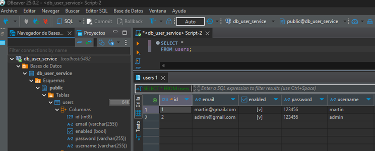
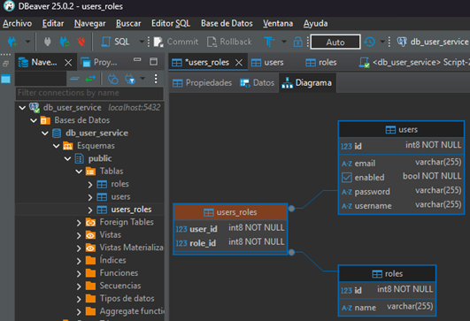

# Sección 09: Microservicio users

---

## Creando el user-service

Creamos el nuevo microservicio `item-service` desde
[Spring Initializr](https://start.spring.io/#!type=maven-project&language=java&platformVersion=3.4.4&packaging=jar&jvmVersion=21&groupId=dev.magadiflo&artifactId=user-service&name=user-service&description=User%20Service&packageName=dev.magadiflo.user.app&dependencies=actuator,web,data-jpa,lombok,postgresql,cloud-eureka,cloud-config-client).

````xml
<!--Spring Boot 3.4.4-->
<!--Spring Cloud 2024.0.1-->
<!--Java 21-->
<dependencies>
    <dependency>
        <groupId>org.springframework.boot</groupId>
        <artifactId>spring-boot-starter-actuator</artifactId>
    </dependency>
    <dependency>
        <groupId>org.springframework.boot</groupId>
        <artifactId>spring-boot-starter-data-jpa</artifactId>
    </dependency>
    <dependency>
        <groupId>org.springframework.boot</groupId>
        <artifactId>spring-boot-starter-web</artifactId>
    </dependency>
    <dependency>
        <groupId>org.springframework.cloud</groupId>
        <artifactId>spring-cloud-starter-config</artifactId>
    </dependency>
    <dependency>
        <groupId>org.springframework.cloud</groupId>
        <artifactId>spring-cloud-starter-netflix-eureka-client</artifactId>
    </dependency>

    <dependency>
        <groupId>org.postgresql</groupId>
        <artifactId>postgresql</artifactId>
        <scope>runtime</scope>
    </dependency>
    <dependency>
        <groupId>org.projectlombok</groupId>
        <artifactId>lombok</artifactId>
        <optional>true</optional>
    </dependency>
    <dependency>
        <groupId>org.springframework.boot</groupId>
        <artifactId>spring-boot-starter-test</artifactId>
        <scope>test</scope>
    </dependency>
</dependencies>
````

## Creando entity User y repositorio JPA

En nuestro `user-service` creamos la entidad `User`.

````java

@AllArgsConstructor
@NoArgsConstructor
@Builder
@Data
@Entity
@Table(name = "users")
public class User {
    @Id
    @GeneratedValue(strategy = GenerationType.IDENTITY)
    private Long id;
    @Column(unique = true)
    private String username;
    private String password;
    private boolean enabled;
    @Column(unique = true)
    private String email;
}
````

Creamos el repositorio para la entidad `User` donde definimos dos métodos utilizando los `Query Methods` de
`Spring Data Jpa`.

````java
public interface UserRepository extends JpaRepository<User, Long> {
    Optional<User> findByUsername(String username);

    Optional<User> findByEmail(String email);
}
````

## Implementando componente service

En este apartado implementaremos la capa de servicio del `user-service`, eso implica que debemos crear clases de
utilitario, dtos, constantes, etc.

Creamos una clase que contendrá las distintas constantes para nuestro microservicio.

````java

@UtilityClass
public class UserConstant {
    public static final String NO_SUCH_ELEMENT_MESSAGE = "The user with id %d does not exist";
    public static final String NO_SUCH_USERNAME_MESSAGE = "The user with username %s does not exist";
    public static final String ILLEGAL_STATE_EXCEPTION = "There is an error with the user with id %d";
}
````

Creamos nuestras clases que manejarán las excepciones.

````java
public record ErrorResponse(int status,
                            String error,
                            String message,
                            String path) {
    @JsonProperty
    public LocalDateTime timestamp() {
        return LocalDateTime.now().truncatedTo(ChronoUnit.SECONDS);
    }
}
````

````java

@RestControllerAdvice
public class GlobalExceptionHandler {

    @ExceptionHandler(NoSuchElementException.class)
    public ResponseEntity<ErrorResponse> apiException(NoSuchElementException exception, HttpServletRequest request) {
        ErrorResponse error = new ErrorResponse(HttpStatus.NOT_FOUND.value(), HttpStatus.NOT_FOUND.getReasonPhrase(), exception.getMessage(), request.getRequestURI());
        return ResponseEntity.status(HttpStatus.NOT_FOUND).body(error);
    }

    @ExceptionHandler(IllegalStateException.class)
    public ResponseEntity<ErrorResponse> apiException(IllegalStateException exception, HttpServletRequest request) {
        ErrorResponse error = new ErrorResponse(HttpStatus.BAD_REQUEST.value(), HttpStatus.BAD_REQUEST.getReasonPhrase(), exception.getMessage(), request.getRequestURI());
        return ResponseEntity.status(HttpStatus.BAD_REQUEST).body(error);
    }

    @ExceptionHandler(Exception.class)
    public ResponseEntity<ErrorResponse> apiException(Exception exception, HttpServletRequest request) {
        ErrorResponse error = new ErrorResponse(HttpStatus.INTERNAL_SERVER_ERROR.value(), HttpStatus.INTERNAL_SERVER_ERROR.getReasonPhrase(), exception.getMessage(), request.getRequestURI());
        return ResponseEntity.status(HttpStatus.INTERNAL_SERVER_ERROR).body(error);
    }
}
````

Creamos los siguientes dtos.

````java
public record UserRequest(String username,
                          String password,
                          String email) {
}
````

````java
public record UserResponse(Long id,
                           String username,
                           boolean enabled,
                           String email) {
}
````

````java
public record UserEnabledRequest(boolean enabled) {
}
````

Creamos una clase mapeadora para convertir dto a entity y viceversa.

````java

@Component
public class UserMapper {
    public UserResponse toUserResponse(User user) {
        return new UserResponse(user.getId(), user.getUsername(), user.isEnabled(), user.getEmail());
    }

    public User toUser(UserRequest request) {
        return User.builder()
                .username(request.username())
                .password(request.password())
                .email(request.email())
                .build();
    }

    public User toUpdateUser(User user, UserRequest request) {
        user.setUsername(request.username());
        user.setEmail(request.email());
        return user;
    }

    public User toUpdateUserEnabled(User user, UserEnabledRequest userEnabledRequest) {
        user.setEnabled(userEnabledRequest.enabled());
        return user;
    }
}
````

Finalmente, creamos la clase de servicio junto a su intefaz.

````java
public interface UserService {
    List<UserResponse> findUsers();

    UserResponse findUser(Long userId);

    UserResponse findUserByUsername(String username);

    UserResponse saveUser(UserRequest userRequest);

    UserResponse updateUser(Long userId, UserRequest userRequest);

    void deleteUser(Long userId);

    UserResponse updateUserEnabled(Long userId, UserEnabledRequest userEnabledRequest);
}
````

````java

@Slf4j
@RequiredArgsConstructor
@Service
@Transactional(readOnly = true)
public class UserServiceImpl implements UserService {

    private final UserRepository userRepository;
    private final UserMapper userMapper;

    @Override
    public List<UserResponse> findUsers() {
        return this.userRepository.findAll().stream()
                .map(this.userMapper::toUserResponse)
                .toList();
    }

    @Override
    public UserResponse findUser(Long userId) {
        return this.userRepository.findById(userId)
                .map(this.userMapper::toUserResponse)
                .orElseThrow(() -> new NoSuchElementException(UserConstant.NO_SUCH_ELEMENT_MESSAGE.formatted(userId)));
    }

    @Override
    public UserResponse findUserByUsername(String username) {
        return this.userRepository.findByUsername(username)
                .map(this.userMapper::toUserResponse)
                .orElseThrow(() -> new NoSuchElementException(UserConstant.NO_SUCH_USERNAME_MESSAGE.formatted(username)));
    }

    @Override
    @Transactional
    public UserResponse saveUser(UserRequest userRequest) {
        User userDB = this.userRepository.save(this.userMapper.toUser(userRequest));
        return this.userMapper.toUserResponse(userDB);
    }

    @Override
    @Transactional
    public UserResponse updateUser(Long userId, UserRequest userRequest) {
        return this.userRepository.findById(userId)
                .map(userDB -> this.userMapper.toUpdateUser(userDB, userRequest))
                .map(this.userRepository::save)
                .map(this.userMapper::toUserResponse)
                .orElseThrow(() -> new NoSuchElementException(UserConstant.NO_SUCH_ELEMENT_MESSAGE.formatted(userId)));
    }

    @Override
    @Transactional
    public void deleteUser(Long userId) {
        User userDB = this.userRepository.findById(userId)
                .orElseThrow(() -> new NoSuchElementException(UserConstant.NO_SUCH_ELEMENT_MESSAGE.formatted(userId)));
        this.userRepository.deleteById(userDB.getId());
    }

    @Override
    @Transactional
    public UserResponse updateUserEnabled(Long userId, UserEnabledRequest userEnabledRequest) {
        return this.userRepository.findById(userId)
                .map(userDB -> this.userMapper.toUpdateUserEnabled(userDB, userEnabledRequest))
                .map(this.userRepository::save)
                .map(this.userMapper::toUserResponse)
                .orElseThrow(() -> new NoSuchElementException(UserConstant.NO_SUCH_ELEMENT_MESSAGE.formatted(userId)));
    }
}
````

## Implementando controlador rest

Implementamos nuestro controlador rest para el `user-service`.

````java

@Slf4j
@RequiredArgsConstructor
@RestController
@RequestMapping(path = "/api/v1/users")
public class UserController {

    private final UserService userService;

    @GetMapping
    public ResponseEntity<List<UserResponse>> findUsers() {
        return ResponseEntity.ok(this.userService.findUsers());
    }

    @GetMapping(path = "/{userId}")
    public ResponseEntity<UserResponse> findUser(@PathVariable Long userId) {
        return ResponseEntity.ok(this.userService.findUser(userId));
    }

    @GetMapping(path = "/username/{username}")
    public ResponseEntity<UserResponse> findUserByUsername(@PathVariable String username) {
        return ResponseEntity.ok(this.userService.findUserByUsername(username));
    }

    @PostMapping
    public ResponseEntity<UserResponse> saveUser(@RequestBody UserRequest userRequest) {
        UserResponse userResponse = this.userService.saveUser(userRequest);
        URI location = URI.create("/api/v1/users/%d".formatted(userResponse.id()));
        return ResponseEntity.created(location).body(userResponse);
    }

    @PutMapping(path = "/{userId}")
    public ResponseEntity<UserResponse> updateUser(@PathVariable Long userId, @RequestBody UserRequest userRequest) {
        return ResponseEntity.ok(this.userService.updateUser(userId, userRequest));
    }

    @DeleteMapping(path = "/{userId}")
    public ResponseEntity<Void> deleteUser(@PathVariable Long userId) {
        this.userService.deleteUser(userId);
        return ResponseEntity.noContent().build();
    }

    @PatchMapping(path = "/{userId}/enabled")
    public ResponseEntity<UserResponse> updateUserEnabled(@PathVariable Long userId, @RequestBody UserEnabledRequest userEnabledRequest) {
        return ResponseEntity.ok(this.userService.updateUserEnabled(userId, userEnabledRequest));
    }
}
````

## Configurando la conexión a PostgresSQL y creando la tabla users

Agregamos ls siguiente configuración en el `application.yml` del `user-service`. En este archivo estamos configurando
la conexión a `PostgreSQL`, `Eureka client` y `Config Server`.

````yml
server:
  port: 0
  error:
    include-message: always

spring:
  application:
    name: user-service
  profiles:
    active: default
  config:
    import: optional:configserver:http://localhost:8888
  datasource:
    url: jdbc:postgresql://localhost:5432/db_user_service
    username: postgres
    password: magadiflo
  jpa:
    hibernate:
      ddl-auto: update
    properties:
      hibernate:
        format_sql: true
    defer-datasource-initialization: true
  sql:
    init:
      mode: always

eureka:
  instance:
    prefer-ip-address: true
    instance-id: ${spring.cloud.client.hostname}:${spring.application.name}:${random.value}
  client:
    service-url:
      defaultZone: http://localhost:8761/eureka/

logging:
  level:
    org.hibernate.SQL: debug
````

Además, para poblar las tablas he creado el archivo `data.sql` con dos registros a insertar.

````sql
TRUNCATE TABLE users RESTART IDENTITY;

INSERT INTO users(id, username, password, enabled, email)
VALUES(1, 'martin', '123456', true, 'martin@gmail.com'),
(2, 'admin', '123456', true, 'admin@gmail.com');

-- Actualiza la secuencia para que el siguiente valor sea 3
SELECT setval('users_id_seq', 2, true);
````

**Nota**

- Como estamos trabajando con `PostgreSQL` y estamos insertando manualmente dos registros, agregando explícitamente sus
  identificadores, necesitamos actualizar manualmente la secuencia de la clave primaria, para que cuando insertemos
  datos usando `spring dat jpa`, estos puedan continuar con la secuencia, es decir, el siguiente registro a insertar
  tendría el valor `id=3`.
- Para actualizar la secuencia usamos el comando `SELECT setval('users_id_seq', 2, true);`, donde:
    - `users_id_seq`, es el nombre de la secuencia que queremos modificar. `PostgreSQL` crea automáticamente una
      secuencia para cada campo `SERIAL`.
    - `2`, es el nuevo valor actual que establecemos a la secuencia. Es decir, la secuencia recordará este valor como el
      último valor generado.
    - `true`, es el parámetro `is_called`. Cuando usamos `true`, le decimos a `PostgreSQL` que el valor `2` ya se ha
      usado, así que el próximo valor generado será `3`. Si fuera `false`, entonces el siguiente valor generado volvería
      a ser `2`.
- Para obtener el nombre de la secuencia, podemos ejecutar este comando en PostgreSQL:
  `SELECT pg_get_serial_sequence('users', 'id');`, cuyo resultado en nuestro caso es `users_id_seq`.

Ahora, nos apoyaremos del propio `hibernate` para crear la tabla de usuarios en la base de datos a partir de la clase
de entidad `User`, esto es gracias a la configuración `spring.jpa.hibernate.ddl-auto=update`. En seguida, luego de que
`hibernate` haya creado la tabla de usuario se ejecutará nuestro `data.sql`. Esta ejecución diferida es gracias a la
configuración `spring.jpa.defer-datasource-initialization=true` y al `spring.sql.init.mode=always`, es decir, primero
deja que `hibernate` ejecute todo lo que tenga que ejecutar y luego recién ejecuta el `data.sql`.

Para ejecutar nuestro `user-service` debemos previamente ejecutar el `discovery-service` ya que en el `application.yml`
hemos agregado la configuración de `Eureka`. Con respecto a `config-server` no es necesario ejecutarlo, dado que no
tenemos configuraciones en ese servidor para nuestro `user-service`.

A continuación se observa que la tabla se ha creado y poblado correctamente.



Como pusimos el puerto aletorio (`server.port=0`), entonces debemos ver en el log qué puerto se generó. Luego, podemos
usar ese puerto para que forme parte de la url para hacer peticiones a nuestro `user-service` (`Nota`. En algunas
peticiones que hago estoy usando puertos distintos porque son pruebas que he estado realizando).

````bash
$ curl -v http://localhost:52860/api/v1/users | jq
>
< HTTP/1.1 200
< Content-Type: application/json
< Transfer-Encoding: chunked
< Date: Tue, 15 Apr 2025 22:24:35 GMT
<
[
  {
    "id": 1,
    "username": "martin",
    "enabled": true,
    "email": "martin@gmail.com"
  },
  {
    "id": 2,
    "username": "admin",
    "enabled": true,
    "email": "admin@gmail.com"
  }
]
````

````bash
$ curl -v http://localhost:52860/api/v1/users/1 | jq
>
< HTTP/1.1 200
< Content-Type: application/json
< Transfer-Encoding: chunked
< Date: Tue, 15 Apr 2025 22:26:01 GMT
<
{
  "id": 1,
  "username": "martin",
  "enabled": true,
  "email": "martin@gmail.com"
}
````

````bash
$ curl -v http://localhost:52860/api/v1/users/username/martin | jq
>
< HTTP/1.1 200
< Content-Type: application/json
< Transfer-Encoding: chunked
< Date: Tue, 15 Apr 2025 22:26:39 GMT
<
{
  "id": 1,
  "username": "martin",
  "enabled": true,
  "email": "martin@gmail.com"
}
````

````bash
$ curl -v -X POST -H "Content-Type: application/json" -d "{\"username\": \"user\", \"password\": \"123456\", \"email\": \"user@gmail.com\"}" http://localhost:52980/api/v1/users | jq
>
< HTTP/1.1 201
< Location: /api/v1/users/3
< Content-Type: application/json
< Transfer-Encoding: chunked
< Date: Tue, 15 Apr 2025 22:37:44 GMT
<
{
  "id": 3,
  "username": "user",
  "enabled": false,
  "email": "user@gmail.com"
}
````

````bash
$ curl -v -X PUT -H "Content-Type: application/json" -d "{\"username\": \"user_home\", \"password\": \"123456home\", \"email\": \"user.home@gmail.com\"}" http://localhost:52980/api/v1/users/3 | jq
>
< HTTP/1.1 200
< Content-Type: application/json
< Transfer-Encoding: chunked
< Date: Tue, 15 Apr 2025 22:41:12 GMT
<
{
  "id": 3,
  "username": "user_home",
  "enabled": false,
  "email": "user.home@gmail.com"
}
````

````bash
$ curl -v -X DELETE http://localhost:52980/api/v1/users/3 | jq
>
< HTTP/1.1 204
< Date: Tue, 15 Apr 2025 22:41:51 GMT
<
````

````bash
$ curl -v -X PATCH -H "Content-Type: application/json" -d "{\"enabled\": false}" http://localhost:56287/api/v1/users/3/enabled | jq
>
< HTTP/1.1 200
< Content-Type: application/json
< Transfer-Encoding: chunked
< Date: Wed, 16 Apr 2025 15:03:58 GMT
<
{
  "id": 3,
  "username": "user",
  "enabled": false,
  "email": "user@gmail.com"
}
````

## Configurando PasswordEncoder BCryptPasswordEncoder

En nuestro `user-service` creamos una clase de configuración donde definimos el bean del `PasswordEncoder`.

````java

@Configuration
public class UserConfig {
    @Bean
    public PasswordEncoder passwordEncoder() {
        return new BCryptPasswordEncoder();
    }
}
````

**Importante**
> Hashear ≠ Cifrar<br>
> Un `hash` es irreversible, es decir: no puedes obtener la contraseña original desde el `hash`.<br>
> Para validar una contraseña, se hashea la que el usuario ingresa y se compara con el hash almacenado en la base de
> datos.<br>

**Resumen**
> Spring Security con `PasswordEncoder` (especialmente con `BCrypt`):<br>
> ✅ Hashea la contraseña (no la codifica ni la cifra)<br>
> ❌ No se puede recuperar la contraseña original<br>
> ✅ Es seguro y recomendado para almacenar contraseñas<br>

Luego, en el `UserMapper` que es donde estamos mapeando un usuario dto a un usuario entity, vamos a inyectar el
`PasswordEncoder` y a usarlo para `hashear la contraseña`.

````java

@RequiredArgsConstructor
@Component
public class UserMapper {

    private final PasswordEncoder passwordEncoder;

    public UserResponse toUserResponse(User user) {
        return new UserResponse(user.getId(), user.getUsername(), user.isEnabled(), user.getEmail());
    }

    public User toUser(UserRequest request) {
        return User.builder()
                .username(request.username())
                .password(this.passwordEncoder.encode(request.password()))
                .enabled(true)
                .email(request.email())
                .build();
    }

    public User toUpdateUser(User user, UserRequest request) {
        user.setUsername(request.username());
        user.setEmail(request.email());
        return user;
    }

    public User toUpdateUserEnabled(User user, UserEnabledRequest userEnabledRequest) {
        user.setEnabled(userEnabledRequest.enabled());
        return user;
    }
}
````

## Creando relación unidireccional entre entity User y Role

Creamos la entidad `Role`.

````java

@AllArgsConstructor
@NoArgsConstructor
@Builder
@Data
@Entity
@Table(name = "roles")
public class Role {
    @Id
    @GeneratedValue(strategy = GenerationType.IDENTITY)
    private Long id;
    @Column(unique = true)
    private String name;
}
````

Nuestra entidad `User` será la dueña de la relación (la `entidad propietaria`), por lo tanto, definiremos la relación
en esta entidad.

````java

@AllArgsConstructor
@NoArgsConstructor
@Builder
@Data
@Entity
@Table(name = "users")
public class User {
    @Id
    @GeneratedValue(strategy = GenerationType.IDENTITY)
    private Long id;
    @Column(unique = true)
    private String username;
    private String password;
    private boolean enabled;
    @Column(unique = true)
    private String email;

    @JoinTable(
            name = "users_roles",
            joinColumns = @JoinColumn(name = "user_id", referencedColumnName = "id"),
            inverseJoinColumns = @JoinColumn(name = "role_id", referencedColumnName = "id"),
            uniqueConstraints = @UniqueConstraint(columnNames = {"user_id", "role_id"})
    )
    @ManyToMany(cascade = {CascadeType.PERSIST, CascadeType.MERGE})
    private Set<Role> roles = new HashSet<>();
}
````

## Creando tablas roles y users_roles

En este apartado crearemos las tablas `roles` y la tabla intermedia `users_roles` apoyándonos de `Spring Data Jpa` y las
anotaciones que usamos en las entidades `Role` y `User`.

Antes de ejecutar la aplicación vamos a modificar el archivo `data.sql` de nuestro `user-service`.

````sql
DELETE FROM users_roles;
DELETE FROM users;
DELETE FROM roles;

INSERT INTO users(id, username, password, enabled, email)
VALUES(1, 'martin', '123456', true, 'martin@gmail.com'),
(2, 'admin', '123456', true, 'admin@gmail.com');

INSERT INTO roles(id, name)
VALUES(1, 'ROLE_USER'),
(2, 'ROLE_ADMIN');

-- Actualiza la secuencia para que el siguiente valor sea 3
SELECT setval('users_id_seq', 2, true);
SELECT setval('roles_id_seq', 2, true);
````

**Donde**

- Hemos cambiado el `TRUNCATE` por `DELETE`. A diferencia de `TRUNCATE`, `DELETE` no afecta la estructura de la tabla
  ni las restricciones de clave foránea. Elimina los registros de las tablas, lo que permite eliminar los datos sin
  violar las restricciones de clave foránea.
- Reinicio de secuencias (`setval`). Reiniciamos las secuencias para que el siguiente valor asignado a los registros
  sea el correcto y no se dupliquen los IDs.

Ejecutamos la aplicación y vemos que las tablas se han creado correctamente en la base de dato.


