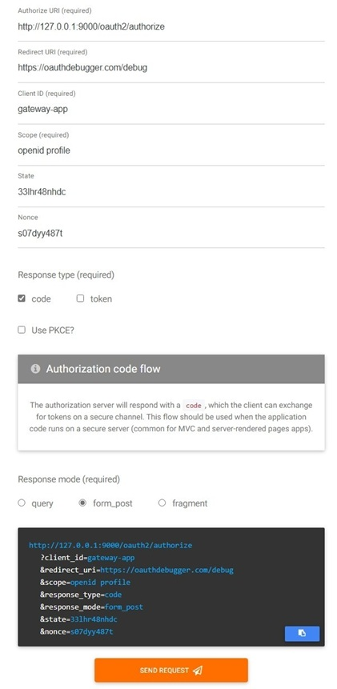
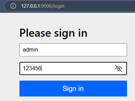
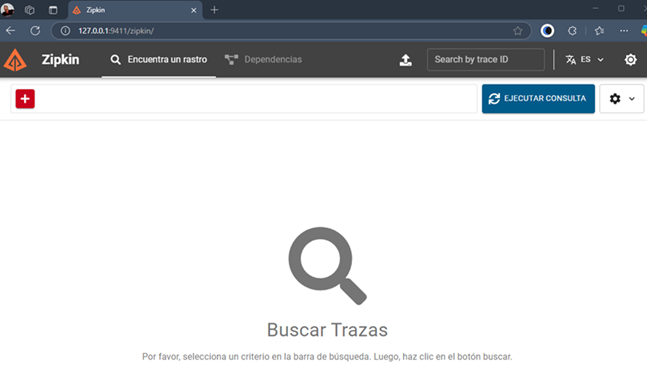

# Sección 11: Trazabilidad distribuida con Micrometer Tracing y Zipkin

---

## Introducción a la trazabilidad distribuida

En 2016, el equipo de `Spring Cloud` creó una biblioteca de rastreo que podría ser de gran ayuda para muchos
desarrolladores. Se llamó `Spring Cloud Sleuth`. El equipo de `Spring` se dio cuenta de que el rastreo podía
separarse de `Spring Cloud` y creó el proyecto `Micrometer Tracing`, que es, esencialmente, una copia de
`Spring Cloud Sleuth` independiente de `Spring`. `Micrometer Tracing` se lanzó con su versión 1.0.0 GA en
noviembre de 2022 y ha mejorado constantemente desde entonces.

### ¿Qué es Micrometer?

`Micrometer` es una `facade (fachada) para métricas` en aplicaciones Java. Es la biblioteca de métricas integrada por
defecto en `Spring Boot 2+`, y permite recolectar y exportar métricas hacia distintos sistemas como `Prometheus`,
`Datadog`, `New Relic`, entre otros.

Desde `Spring Boot 3`, `Micrometer` también incluye soporte para trazabilidad distribuida a través de su módulo llamado
`Micrometer Tracing`, que reemplaza al antiguo `spring-cloud-sleuth`.

### Funciones clave de Micrometer Tracing:

- Generación automática de `trazas (traces)` y `spans` para cada solicitud entrante y saliente.
- `Propagación de contexto` entre microservicios, incluso cuando se usan tecnologías reactivas como `WebFlux`.
- Soporte para `exportación de trazas` hacia sistemas como `Zipkin` o `OpenTelemetry`.
- Integración fluida con `Spring Cloud Gateway`, `RestTemplate`, `WebClient`, `Feign`, etc.

### ¿Qué es Zipkin?

`Zipkin` es una herramienta de trazabilidad distribuida desarrollada por Twitter. Su propósito es recoger, almacenar y
visualizar trazas de solicitudes que fluyen entre los diferentes servicios de una arquitectura distribuida (como los
microservicios).

### Funcionalidades principales:

- Visualización de `todo el recorrido de una solicitud` a través de múltiples microservicios.
- Análisis de `latencia`, cuellos de botella, y puntos de fallo.
- Muestra de cada `span` (segmento de una operación) con detalles como duración, nombre del servicio, etiquetas
  personalizadas, etc.

### ¿Cómo se conecta con Micrometer?

`Micrometer Tracing` puede usar un reporter para enviar las trazas recolectadas a `Zipkin`. Así, `Zipkin` se convierte
en el backend de visualización de las trazas generadas por tu aplicación.

### Relación entre Micrometer y Zipkin

| Componente           | Rol                                       |
|----------------------|-------------------------------------------|
| `Micrometer Tracing` | Genera y gestiona trazas/spans en la app. |
| `Zipkin`             | Recibe, almacena y visualiza las trazas.  |

### ¿Qué son el `traceId` y el `spanId`?

En un sistema de `trazabilidad distribuida`, como el que se implementa con `Micrometer Tracing` y `Zipkin`, se utiliza
una estructura jerárquica para rastrear cómo una solicitud fluye a través de varios servicios.

1. 📍 `traceId` (ID de traza)

- Es un `identificador único` que representa una `única solicitud de extremo a extremo` a través de todo el sistema
  distribuido.
- Todos los `spans` (segmentos) relacionados con esa solicitud comparten el mismo `traceId`.
- Permite reconstruir toda la cadena de eventos y llamadas que ocurrieron desde el inicio hasta el final de la petición.

  > 🧠 `Ejemplo`: Una solicitud HTTP que entra por el `gateway-server` y luego pasa a `item-service` y después a
  > `product-service`, tendrá el mismo `traceId` en todos esos servicios.

2. 📍 `spanId` (ID de segmento)

- Es un `identificador único` para una `operación individual dentro del sistema`.
- Cada vez que un servicio realiza una operación (como llamar a otro servicio, acceder a una base de datos, etc.), se
  crea un nuevo `span` con su propio `spanId`.
- Un `span` puede tener un `parentSpanId`, que indica quién lo invocó.

  > 🧠 `Ejemplo`: El `gateway-server` recibe una solicitud y genera un `spanId`. Luego, cuando llama al `item-service`,
  > se genera otro `spanId` con el `spanId` del `gateway` como padre.

Imaginemos la siguiente estructura de llamada:

````
traceId: abc123
└── spanId: 001 (Gateway)
    ├── spanId: 002 (Llamada a item-service)
    └── spanId: 003 (Llamada a product-service)
````

- Todos los `spanId` están relacionados al mismo `traceId` porque son parte de la misma solicitud.
- Pero cada operación tiene su propio `spanId`, lo que permite saber qué parte de la solicitud tomó cuánto tiempo y
  dónde se ejecutó.

## Agregando Dependencia de Micrometer Tracing

En este apartado nos guiaremos de la
[documentación oficial de Micrometer Tracing](https://docs.micrometer.io/tracing/reference/tracers.html) para obtener
la dependencia que agregaremos a nuestros proyectos.

Agregamos las siguientes dependencias en el `pom.xml` de los siguientes microservicios:

- item-service
- product-service
- user-service
- gateway-server
- authorization-server

````xml

<dependencies>
    <dependency>
        <groupId>org.springframework.boot</groupId>
        <artifactId>spring-boot-starter-actuator</artifactId>
    </dependency>
    <dependency>
        <groupId>io.micrometer</groupId>
        <artifactId>micrometer-tracing-bridge-brave</artifactId>
    </dependency>
</dependencies>
````

**Nota**
> La dependencia `micrometer-tracing-bridge-brave` incluye transitivamente la dependencia `micrometer-tracing`, por lo
> que `no es necesario declararla por separado`.
>
> Se utiliza la dependencia `spring-boot-starter-actuator` para habilitar los endpoints de `observabilidad` y `salud`
> del sistema.

### 1. ✅ micrometer-tracing

- Esta es la `API base de trazabilidad distribuida` proporcionada por `Micrometer`.
- Define las interfaces genéricas como `Tracer`, `Span`, `ContextPropagator`, etc.
- No contiene implementación específica: `no genera ni reporta trazas por sí sola`.
- Es útil si estás creando algo muy personalizado o si estás haciendo una librería que no debe acoplarse a una
  implementación en particular (como `Brave` u `OpenTelemetry`).

### 2. ✅ micrometer-tracing-bridge-brave

- Esta es la `implementación que conecta Micrometer con Brave`, el motor de trazabilidad desarrollado originalmente por
  Twitter (y usado por Zipkin).
- Al incluir esta dependencia:
    - Se implementan las interfaces de `micrometer-tracing`.
    - Se integra automáticamente con `Spring Boot`.
    - Se activa el trazado y la `propagación de contexto` con `Brave`.

## Configurando trazabilidad

Agregamos las siguientes configuraciones en el `application.yml` de los siguientes microservicios:

- item-service
- product-service
- user-service
- gateway-server
- authorization-server

````yml
management:
  tracing:
    sampling:
      probability: 1.0
````

La configuración anterior define `cuántas trazas se van a capturar` en tu aplicación.

- Es una probabilidad de muestreo entre `0.0` y `1.0`.
- `1.0` → se capturan todas las trazas (100% de las solicitudes).
- `0.5` → se capturan el `50%` de las solicitudes de forma aleatoria.
- `0.0` → no se captura ninguna traza.

> ✅ Esto es `muy útil en desarrollo`, porque te permite ver todo el flujo de las peticiones entre microservicios.<br>
> ⚠️ En producción, a veces se recomienda bajar esta probabilidad (por ejemplo, a 0.1) para no sobrecargar tu sistema
> de observabilidad.

## Añadiendo Logs en nuestros microservicios para agregarlos a Micrometer Tracing

Como ya estamos usando el `@Slf4j` en las clases de nuestros servicios, podemos hacer uso directo de `log.info(...)`,
`log.warn(...)`, `log.error(...)`, etc. El detalle es saber dónde y cómo agregar logs en las clases para aprovechar el
`traceId` y `spanId`, y facilitar el seguimiento distribuido.

En nuestro caso, agregaremos logs en algunos de los microservicios como el `item-service`, `product-service` y
`user-service`.

1. `Entradas de métodos públicos`, agrega `log.info(...)` al inicio de cada método para registrar que la operación fue
   invocada. Esto ayuda a tener una traza clara en `Zipkin`.
    ````java
    
    @Override
    public List<UserResponse> findUsers() {
        log.info("Buscando todos los usuarios");
        return this.userRepository.findAll().stream()
                .map(this.userMapper::toUserResponse)
                .toList();
    }
    ````

2. `Parámetros importantes`, loguea valores relevantes, como `IDs`, `usernames` o `parámetros` que te ayuden a
   identificar la llamada.
    ````java
    
    @Override
    public UserResponse findUser(Long userId) {
        log.info("Buscando usuario por id: {}", userId);
        return this.userRepository.findById(userId)
                .map(this.userMapper::toUserResponse)
                .orElseThrow(() -> {
                    log.warn("No se encontró el usuario con id: {}", userId);
                    return new NoSuchElementException(UserConstant.NO_SUCH_ELEMENT_MESSAGE.formatted(userId));
                });
    }
    ````

3. `Acciones de escritura (save, update, delete)`, loguea el tipo de acción y datos relevantes (como userId, nombre de
   usuario, etc.).
    ````java
    
    @Override
    @Transactional
    public UserResponse saveUser(UserRequest userRequest) {
        log.info("Guardando nuevo usuario con username: {}", userRequest.username());
        User userToSave = this.userMapper.toUser(userRequest);
        String role = userRequest.isAdmin() != null && userRequest.isAdmin() ? Roles.ROLE_ADMIN.name() : Roles.ROLE_USER.name();
        Optional<Role> roleOptional = this.roleRepository.findByName(role);
        if (roleOptional.isPresent()) {
            log.info("Asignando el rol {} al usuario {}", roleOptional.get(), userRequest.username());
            Set<Role> roles = new HashSet<>();
            roles.add(roleOptional.get());
            userToSave.setRoles(roles);
        }
        User userDB = this.userRepository.save(userToSave);
        log.info("Usuario creado con éxito: {}", userDB.getId());
        return this.userMapper.toUserResponse(userDB);
    }
    ````

4. `Errores y condiciones especiales`, usa `log.warn` o `log.error` para condiciones anómalas, como roles inválidos.
    ````java
    
    @Override
    @Transactional
    public UserResponse updateUserRoles(Long userId, Set<String> roleNames) {
        log.info("Actualizando roles para el usuario con id: {}", userId);
        boolean invalidRoleExists = roleNames.stream()
                .anyMatch(roleName -> !Roles.exists(roleName));
    
        if (invalidRoleExists) {
            log.warn("Se intentó asignar uno o más roles inválidos: {}", roleNames);
            throw new IllegalStateException(UserConstant.ILLEGAL_STATE_ROLE_EXCEPTION);
        }
    
        Set<Role> rolesDB = this.roleRepository.findAllByNameIn(roleNames);
    
        return this.userRepository.findById(userId)
                .map(userDB -> this.userMapper.toUpdateUserRoles(userDB, rolesDB))
                .map(this.userRepository::save)
                .map(this.userMapper::toUserResponse)
                .orElseThrow(() -> new NoSuchElementException(UserConstant.NO_SUCH_ELEMENT_MESSAGE.formatted(userId)));
    }
    ````

5. `Confirmaciones o trazas adicionales`, puedes agregar logs finales opcionales si quieres marcar el éxito de una
   operación importante.
    ````bash
    log.info("Usuario actualizado con éxito: {}", userId);
    ````

## Propagación automática del contexto reactivo para trazabilidad (traceId, spanId)

En aplicaciones `reactivas` (como `Spring Cloud Gateway`), los contextos como `traceId` y `spanId` no se propagan
automáticamente entre hilos o entre operadores `Mono/Flux`. Esto ocasiona que:

- No se registre la traza correctamente en los logs (`traceId`, `spanId` aparecen como vacíos).
- No se transmitan los datos del contexto en subprocesos asíncronos.
- Los logs de trazabilidad en filtros globales (como `GlobalFilter`) no muestren el `ID de traza`, incluso si
  `Micrometer` y `Spring Sleuth/OpenTelemetry` están correctamente configurados.

En aplicaciones `reactivas`, como las que usan `Reactor (Project Reactor)`, el contexto (como `traceId`, `spanId`,
`Authentication`, etc.) no viaja automáticamente a través de hilos como en aplicaciones imperativas. Por eso,
los valores que esperamos ver en los logs, como los de trazabilidad, desaparecen al cambiar de hilo.

Por ejemplo, si vemos en ejecución el log de nuestro `gateway-server` sin haber realizado alguna configuración de
contexto, observamos que el `traceId` y el `spanId` no se muestran.

````bash
INFO 18240 --- [gateway-server] [     parallel-1] [                                                 ] d.m.g.s.app.filter.SampleGlobalFilter    : Global: ejecutando filtro request PRE
INFO 18240 --- [gateway-server] [ctor-http-nio-4] [                                                 ] d.m.g.s.app.filter.SampleGlobalFilter    : Global: ejecutando filtro response POST
````

Para solucionar ese problema agregamos el `Hooks.enableAutomaticContextPropagation()` en el método main de la clase
principal de la aplicación `gateway-server`.

````java

@SpringBootApplication
public class GatewayServerApplication {

    public static void main(String[] args) {
        // Habilita la propagación automática del contexto de Reactor (incluyendo traceId y spanId) 
        // antes de que se inicialice el contexto de Spring. 
        // Esto permite que los logs muestren trazabilidad automáticamente.
        Hooks.enableAutomaticContextPropagation();

        SpringApplication.run(GatewayServerApplication.class, args);
    }
}
````

**¿Qué es lo que hace?**

- Habilita la `propagación automática del contexto` de Reactor.
- Garantiza que el contexto de seguimiento se propague automáticamente entre subprocesos y límites asíncronos dentro de
  flujos reactivos.
- Esto es crucial para mantener un seguimiento consistente en toda la aplicación, incluso cuando la ejecución salta
  entre subprocesos o implica operaciones no bloqueantes.
- Esto permite que el `ContextView` (que es donde se guardan esos datos de trazabilidad) se `inyecte` correctamente
  en los hilos donde haces logs, incluso después de cambios de hilo.

**¿Por qué debe colocarse en el `main()`?**

- `Hooks.enableAutomaticContextPropagation()` debe ejecutarse antes de que se construya el `ApplicationContext` de
  `Spring` para garantizar que la propagación del contexto esté activa desde el inicio.
- Esto asegura que todos los componentes que usan Reactor (`Mono`, `Flux`) estén correctamente envueltos con la lógica
  de propagación de contexto.

Ahora que hemos agregado `Hooks.enableAutomaticContextPropagation()` en nuestra clase principal del `gateway-server`
vemos en ejecución los logs generados. ¡Ya se muestra el `traceId` y el `spanId`!

````bash
INFO 18108 --- [gateway-server] [     parallel-1] [680805d8e0b37fc3d0a5c91e06508d17-98f7338e37a8c76a] d.m.g.s.app.filter.SampleGlobalFilter    : Global: ejecutando filtro request PRE
INFO 18108 --- [gateway-server] [ctor-http-nio-4] [680805d8e0b37fc3d0a5c91e06508d17-98f7338e37a8c76a] d.m.g.s.app.filter.SampleGlobalFilter    : Global: ejecutando filtro response POST
````

### Nota

La siguiente configuración es equivalente funcionalmente a llamar a `Hooks.enableAutomaticContextPropagation()`.
Esta propiedad le indica a `Spring Boot 3+` (cuando usas `Micrometer Tracing y Reactor`) que habilite automáticamente
la propagación del contexto reactivo, incluyendo cosas como `traceId`, `spanId`, `MDC`, etc., sin necesidad de llamar
manualmente a `Hooks.enableAutomaticContextPropagation()`.

````yml
spring:
  reactor:
    context-propagation: auto
````

En mi caso optaré por seguir usando el `Hooks.enableAutomaticContextPropagation()`.

## Revisando trazas generadas

Ejecutamos las aplicaciones en el siguiente orden:

- config-server
- discovery-server
- authorization-server
- product-service, item-service, user-service
- gateway-server

Realizamos la siguiente petición. Esto irá primero al `gateway-server`, luego al `item-service` y finalmente al
`product-service`.

````bash
$ curl -v http://localhost:8090/api/v1/items | jq
>
< HTTP/1.1 200 OK
< transfer-encoding: chunked
< Content-Type: application/json
< Date: Tue, 22 Apr 2025 21:31:57 GMT
< token-response: 123456
< X-Response-color: green
< Cache-Control: no-cache, no-store, max-age=0, must-revalidate
< Pragma: no-cache
< Expires: 0
< X-Content-Type-Options: nosniff
< X-Frame-Options: DENY
< X-XSS-Protection: 0
< Referrer-Policy: no-referrer
< set-cookie: color=red
<
[
  {
    "product": {
      "id": 1,
      "name": "Panasonic",
      "price": 800.00,
      "createAt": "2025-04-22T15:05:22",
      "port": 62091
    },
    "quantity": 1,
    "total": 800.00
  },
  {...},
  {
    "product": {
      "id": 9,
      "name": "Reebok",
      "price": 300.00,
      "createAt": "2025-04-22T15:05:22",
      "port": 62091
    },
    "quantity": 1,
    "total": 300.00
  }
]
````

- ### Logs del Gateway Server
    ````bash
    INFO 21948 --- [gateway-server] [     parallel-3] [68080acd1650d3de7130b5db0b629e5f-3514862aa0a44e20] d.m.g.s.app.filter.SampleGlobalFilter    : Global: ejecutando filtro request PRE
    INFO 21948 --- [gateway-server] [ctor-http-nio-6] [68080acd1650d3de7130b5db0b629e5f-3514862aa0a44e20] d.m.g.s.app.filter.SampleGlobalFilter    : Global: ejecutando filtro response POST
    ````
  En los logs del `gateway-server` se están viendo correctamente la trazabilidad:.

    - `traceId`: 68080acd1650d3de7130b5db0b629e5f
    - `spanId`: 3514862aa0a44e20

- ### Logs del Item Service
    ````bash
    INFO 5544 --- [item-service] [nio-8085-exec-3] [68080acd1650d3de7130b5db0b629e5f-2bd00b470ed9fe8a] .m.i.a.s.i.ItemServiceWithRestClientImpl : Obteniendo productos desde el product-service
    INFO 5544 --- [item-service] [nio-8085-exec-3] [68080acd1650d3de7130b5db0b629e5f-2bd00b470ed9fe8a] .m.i.a.s.i.ItemServiceWithRestClientImpl : Productos recuperados desde el product-service: 9
    INFO 5544 --- [item-service] [nio-8085-exec-3] [68080acd1650d3de7130b5db0b629e5f-2bd00b470ed9fe8a] .m.i.a.s.i.ItemServiceWithRestClientImpl : Generando items a partir de los productos recuperados
    ````
  En los logs del `item-service` también se mantiene el mismo `traceId` (`68080acd1650d3de7130b5db0b629e5f`), lo
  cual confirma que `la trazabilidad se está propagando correctamente` desde el `gateway-server` hacia el
  `item-service`.

- ### Logs del Product Service
    ````bash
    INFO 13504 --- [product-service] [o-auto-1-exec-5] [68080acd121e7b6f72ebe7f8e27075de-72ebe7f8e27075de] d.m.p.a.service.impl.ProductServiceImpl  : Buscando todos los productos
    DEBUG 13504 --- [product-service] [o-auto-1-exec-5] [68080acd121e7b6f72ebe7f8e27075de-72ebe7f8e27075de] org.hibernate.SQL                        : 
        select
            p1_0.id,
            p1_0.create_at,
            p1_0.name,
            p1_0.price 
        from
            products p1_0
    INFO 13504 --- [product-service] [o-auto-1-exec-5] [68080acd121e7b6f72ebe7f8e27075de-72ebe7f8e27075de] d.m.p.a.service.impl.ProductServiceImpl  : Obteniendo el puerto donde se ejecuta este microservicio
    INFO 13504 --- [product-service] [o-auto-1-exec-5] [68080acd121e7b6f72ebe7f8e27075de-72ebe7f8e27075de] d.m.p.a.service.impl.ProductServiceImpl  : Obteniendo el puerto donde se ejecuta este microservicio
    INFO 13504 --- [product-service] [o-auto-1-exec-5] [68080acd121e7b6f72ebe7f8e27075de-72ebe7f8e27075de] d.m.p.a.service.impl.ProductServiceImpl  : Obteniendo el puerto donde se ejecuta este microservicio
    INFO 13504 --- [product-service] [o-auto-1-exec-5] [68080acd121e7b6f72ebe7f8e27075de-72ebe7f8e27075de] d.m.p.a.service.impl.ProductServiceImpl  : Obteniendo el puerto donde se ejecuta este microservicio
    INFO 13504 --- [product-service] [o-auto-1-exec-5] [68080acd121e7b6f72ebe7f8e27075de-72ebe7f8e27075de] d.m.p.a.service.impl.ProductServiceImpl  : Obteniendo el puerto donde se ejecuta este microservicio
    INFO 13504 --- [product-service] [o-auto-1-exec-5] [68080acd121e7b6f72ebe7f8e27075de-72ebe7f8e27075de] d.m.p.a.service.impl.ProductServiceImpl  : Obteniendo el puerto donde se ejecuta este microservicio
    INFO 13504 --- [product-service] [o-auto-1-exec-5] [68080acd121e7b6f72ebe7f8e27075de-72ebe7f8e27075de] d.m.p.a.service.impl.ProductServiceImpl  : Obteniendo el puerto donde se ejecuta este microservicio
    INFO 13504 --- [product-service] [o-auto-1-exec-5] [68080acd121e7b6f72ebe7f8e27075de-72ebe7f8e27075de] d.m.p.a.service.impl.ProductServiceImpl  : Obteniendo el puerto donde se ejecuta este microservicio
    INFO 13504 --- [product-service] [o-auto-1-exec-5] [68080acd121e7b6f72ebe7f8e27075de-72ebe7f8e27075de] d.m.p.a.service.impl.ProductServiceImpl  : Obteniendo el puerto donde se ejecuta este microservicio
    ````
  El `traceId` en el `product-service` es diferente al del `gateway-server` y `item-service`.

### ¿Por qué el `gateway-server` sí propaga las trazas automáticamente?

El `gateway-server` está construido sobre `Spring Cloud Gateway`, que usa `WebFlux (reactivo)`. Y `Spring Cloud Gateway`
ya viene integrado con la infraestructura de `observabilidad` de `Spring (Micrometer + Brave/OpenTelemetry)`, lo que
permite que:

- Cuando llega una solicitud HTTP externa, `Spring Gateway` genera o recupera el `traceId/spanId`.
- Luego, cuando reenvía la solicitud (por ejemplo, a `item-service`), `Spring Gateway` propaga automáticamente los
  headers de trazabilidad, como `traceparent` o `b3`.

✅ Eso funciona `out-of-the-box`, sin necesidad de agregar manualmente headers.

### ¿Y por qué el `item-service` no propaga automáticamente?

Cuando tú, desde el `item-service`, haces una llamada `HTTP` a otro microservicio (en este caso al `product-service`)
usando `RestClient` o `RestTemplate`, el contexto de trazabilidad no se propaga automáticamente, a menos que lo
configures correctamente.

Esto pasa porque:

- El `RestClient` (o `RestTemplate`) necesita que se le agregue un interceptor que tome el `traceId/spanId` actual del
  contexto y lo ponga en los headers de la solicitud HTTP.
- Si tú instancias el `RestClient` manualmente (por ejemplo, con `new RestClient()`), ese interceptor no está presente.

## Propagando contexto de trazas entre microservicios con RestClient + LoadBalanced

Para propagar automáticamente los rastros a través de la red, utilice `RestTemplateBuilder`, `RestClient.Builder` o
`WebClient.Builder` configurados automáticamente para construir el cliente. Este gestiona automáticamente la propagación
de los `ID de seguimiento` y otra información relevante mediante `encabezados HTTP`.

> ⚠️ Si crea `RestClient` manualmente, es decir, sin utilizar los builders configurados automáticamente
> `¡la propagación de seguimientos no funcionará correctamente!`.

A continuación, se detalla más:

1. Usar `RestClient.Builder`, en lugar de crear `RestClient` directamente, use `RestClient.Builder` para construir su
   cliente.


2. `Propagación automática`, `RestClient.Builder` agrega automáticamente los encabezados necesarios (como `traceId`,
   `spanId` y `parentId`) a las solicitudes HTTP.


3. `Sin configuración manual`, no es necesario configurar ni agregar encabezados manualmente para la propagación de
   seguimientos al usar el constructor.


4. `Spring Boot Actuator`, asegúrese de tener la dependencia `spring-boot-starter-actuator` para
   habilitar la funcionalidad de seguimiento.

En `resumen`, confiar en `RestClient.Builder`, configurado automáticamente, garantiza que los ID de rastreo y otra
información relevante se propaguen automáticamente al realizar llamadas REST entre microservicios, lo que simplifica
el proceso de rastreo.

> En nuestro caso, hemos comprobado que inyectar el `RestClient.Builder` que proporciona por defecto Spring Boot
> funciona perfectamente para la propagación de las trazas, pero eso interfiere con el `@LoadBalanced` que también
> necesitamos usar.

### Solución ideal: Combinar ambos (@LoadBalanced + observabilidad de Spring)

Para que ambas cosas funcionen `(trazas + @LoadBalanced)`, necesitamos usar la clase `RestClientCustomizer` que
`instrumenta` el builder y luego aplicarle `@LoadBalanced`.

En la clase de configuración `RestClientConfig` de nuestro `item-service` realizamos la siguiente modificación a
nuestro `@Bean RestClient.Builder` pues ahora utilizaremos dos beans para dar soporte tanto a la propagación de la
trazabilidad y al balanceo de carga.

````java

@Configuration
public class RestClientConfig {

    @Value("${custom.base-url.product-service}")
    private String productServiceBaseUrl;

    @LoadBalanced
    @Bean
    public RestClient.Builder restClientBuilder(List<RestClientCustomizer> customizers) {
        RestClient.Builder builder = RestClient.builder();
        customizers.forEach(customizer -> customizer.customize(builder)); // Aplica los customizers de Spring para la observabilidad
        return builder;
    }

    @Bean(name = "productRestClient")
    public RestClient productRestClient(@Qualifier("restClientBuilder") RestClient.Builder builder) {
        return builder.baseUrl(this.productServiceBaseUrl).build();
    }
}
````

**Dónde**

- Usamos `@LoadBalanced` para que el builder use `Eureka`. Recordemos que esta anotación marca un bean `RestTemplate`,
  `RestClient.Builder` o `WebClient.Builder` que se configurará para usar un `LoadBalancerClient`.

- `List<RestClientCustomizer>`, `Spring` te inyecta todos los `customizers` que haya registrado automáticamente, como
  los que agregan trazabilidad (`traceId`, `spanId`), métricas, entre otros.

  > Los `RestClientCustomizer` que vienen en la lista inyectada son: `ObservationRestClientCustomizer` y el
  > `HttpMessageConvertersRestClientCustomizer`

Aunque en el bean estamos creando manualmente un `RestClient.Builder` (`RestClient.builder()`), lo cual,
según la documentación, `¡la propagación de seguimientos no funcionará correctamente!`. Por el contrario, lo que se
recomienda es inyectar el `RestClient.Builder` para obtener la configuración por defecto que crea Spring Boot y con
él las características de trazabilidad, etc.

La forma cómo lo hemos trabajado con los dos beans, sí funciona correctamente, es decir, que pese a que hemos creado
manualmente `RestClient.Builder builder = RestClient.builder()`, luego le estamos agregando los `RestClientCustomizer`
de la lista `List<RestClientCustomizer>`, es en este momento donde instrumentamos manualmente o le dotamos de la
característica de trazabilidad al `RestClient`, en nuestro caso el `ObservationRestClientCustomizer` y el
`HttpMessageConvertersRestClientCustomizer` son los responsables de devolverle la mágia al builder que nosotros creamos
manualmente.

Ahora, si hubiera hecho uso de esta configuración para obtener las características por defecto del `RestClient.Builder`:

````java

@Bean
@LoadBalanced
public RestClient.Builder restClientBuilder(RestClient.Builder builder) {
    return builder;
}
````

Me generaría un error `dependencia circular`, es decir, inyectar el `RestClient.Builder` como parámetro al mismo bean,
causa el ciclo.

Por lo tanto, nosotros no estamos pidiendo el bean `RestClient.Builder` autoconfigurado, sino que estamos:

- Creando un builder manual (`RestClient.builder()`),
- Luego estamos aplicando nosotros mismos los `RestClientCustomizer`, que son los que `Spring` mismo habría aplicado
  internamente para aportar `trazabilidad` y `métricas`, convertidores para `JSON/XML`, etc.

Finalmente, como último cambio, en la clase de servicio `ItemServiceWithRestClientImpl` debemos inyectar la interfaz
`RestClient`, tal como se muestra a continuación.

````java

@Slf4j
@Service
public class ItemServiceWithRestClientImpl implements ItemService {

    private final RestClient productRestClient;

    public ItemServiceWithRestClientImpl(@Qualifier("productRestClient") RestClient productRestClient) {
        this.productRestClient = productRestClient;
    }
    /* code */
}
````

## Probando la propagación del contexto de trazas entre microservicios con RestClient + LoadBalanced

Ejecutamos las aplicaciones en el siguiente orden:

- config-server
- discovery-server
- authorization-server
- product-service (3 instancias), item-service, user-service
- gateway-server

### Ejecución 01

Realizamos la siguiente petición. Esto irá primero al `gateway-server`, luego al `item-service` y finalmente a una de
las 3 instancias que generamos del `product-service`.

````bash
$ curl -v http://localhost:8090/api/v1/items | jq
>
< HTTP/1.1 200 OK
< transfer-encoding: chunked
< Content-Type: application/json
< Date: Wed, 23 Apr 2025 20:28:55 GMT
< token-response: 123456
< X-Response-color: green
< Cache-Control: no-cache, no-store, max-age=0, must-revalidate
< Pragma: no-cache
< Expires: 0
< X-Content-Type-Options: nosniff
< X-Frame-Options: DENY
< X-XSS-Protection: 0
< Referrer-Policy: no-referrer
< set-cookie: color=red
<
[
  {
    "product": {
      "id": 1,
      "name": "Panasonic",
      "price": 800.00,
      "createAt": "2025-04-23T15:27:07",
      "port": 53019
    },
    "quantity": 1,
    "total": 800.00
  },
  {...}
]
````

Observamos que en la petición anterior la instancia que se ejecutó del `product-service` fue el del puerto `53019`.

- En el `gateway-server` obtenemos el siguiente `traceId` y `spanId`.

````bash
INFO 2908 --- [gateway-server] [     parallel-1] [68094d864800f468f4e4123fb2d5e88d-947bed958f985a5d] d.m.g.s.app.filter.SampleGlobalFilter    : Global: ejecutando filtro request PRE
INFO 2908 --- [gateway-server] [ctor-http-nio-4] [68094d864800f468f4e4123fb2d5e88d-947bed958f985a5d] d.m.g.s.app.filter.SampleGlobalFilter    : Global: ejecutando filtro response POST
````

- En el `item-service` obtenemos el mismo `traceId` que se obtuvo en el `gateway-server` con un nuevo `spanId`.

````bash
INFO 12440 --- [item-service] [nio-8085-exec-2] [68094d864800f468f4e4123fb2d5e88d-0ae72b4f828ea169] .m.i.a.s.i.ItemServiceWithRestClientImpl : Obteniendo productos desde el product-service
INFO 12440 --- [item-service] [nio-8085-exec-2] [68094d864800f468f4e4123fb2d5e88d-0ae72b4f828ea169] .m.i.a.s.i.ItemServiceWithRestClientImpl : Productos recuperados desde el product-service: 9
INFO 12440 --- [item-service] [nio-8085-exec-2] [68094d864800f468f4e4123fb2d5e88d-0ae72b4f828ea169] .m.i.a.s.i.ItemServiceWithRestClientImpl : Generando items a partir de los productos recuperados
````

- En la instancia del `product-service` con puerto `53019` se obtuvo el mismo `traceId` del `item-service` con un nuevo
  `spanId`.

````bash
INFO 5500 --- [product-service] [o-auto-1-exec-1] [68094d864800f468f4e4123fb2d5e88d-15e2249c27328c9d] d.m.p.a.service.impl.ProductServiceImpl  : Buscando todos los productos
DEBUG 5500 --- [product-service] [o-auto-1-exec-1] [68094d864800f468f4e4123fb2d5e88d-15e2249c27328c9d] org.hibernate.SQL                        : 
    select
        p1_0.id,
        p1_0.create_at,
        p1_0.name,
        p1_0.price 
    from
        products p1_0
INFO 5500 --- [product-service] [o-auto-1-exec-1] [68094d864800f468f4e4123fb2d5e88d-15e2249c27328c9d] d.m.p.a.service.impl.ProductServiceImpl  : Obteniendo el puerto donde se ejecuta este microservicio
INFO 5500 --- [product-service] [o-auto-1-exec-1] [68094d864800f468f4e4123fb2d5e88d-15e2249c27328c9d] d.m.p.a.service.impl.ProductServiceImpl  : Obteniendo el puerto donde se ejecuta este microservicio
INFO 5500 --- [product-service] [o-auto-1-exec-1] [68094d864800f468f4e4123fb2d5e88d-15e2249c27328c9d] d.m.p.a.service.impl.ProductServiceImpl  : Obteniendo el puerto donde se ejecuta este microservicio
INFO 5500 --- [product-service] [o-auto-1-exec-1] [68094d864800f468f4e4123fb2d5e88d-15e2249c27328c9d] d.m.p.a.service.impl.ProductServiceImpl  : Obteniendo el puerto donde se ejecuta este microservicio
INFO 5500 --- [product-service] [o-auto-1-exec-1] [68094d864800f468f4e4123fb2d5e88d-15e2249c27328c9d] d.m.p.a.service.impl.ProductServiceImpl  : Obteniendo el puerto donde se ejecuta este microservicio
INFO 5500 --- [product-service] [o-auto-1-exec-1] [68094d864800f468f4e4123fb2d5e88d-15e2249c27328c9d] d.m.p.a.service.impl.ProductServiceImpl  : Obteniendo el puerto donde se ejecuta este microservicio
INFO 5500 --- [product-service] [o-auto-1-exec-1] [68094d864800f468f4e4123fb2d5e88d-15e2249c27328c9d] d.m.p.a.service.impl.ProductServiceImpl  : Obteniendo el puerto donde se ejecuta este microservicio
INFO 5500 --- [product-service] [o-auto-1-exec-1] [68094d864800f468f4e4123fb2d5e88d-15e2249c27328c9d] d.m.p.a.service.impl.ProductServiceImpl  : Obteniendo el puerto donde se ejecuta este microservicio
INFO 5500 --- [product-service] [o-auto-1-exec-1] [68094d864800f468f4e4123fb2d5e88d-15e2249c27328c9d] d.m.p.a.service.impl.ProductServiceImpl  : Obteniendo el puerto donde se ejecuta este microservicio
````

### Ejecución 02

Realizamos una segunda petición para observar que el `loadBalancer` esté funcionando y también la propagación de las
trazas.

````bash
$ curl -v http://localhost:8090/api/v1/items | jq
>
< HTTP/1.1 200 OK
< transfer-encoding: chunked
< Content-Type: application/json
< Date: Wed, 23 Apr 2025 20:39:26 GMT
< token-response: 123456
< X-Response-color: green
< Cache-Control: no-cache, no-store, max-age=0, must-revalidate
< Pragma: no-cache
< Expires: 0
< X-Content-Type-Options: nosniff
< X-Frame-Options: DENY
< X-XSS-Protection: 0
< Referrer-Policy: no-referrer
< set-cookie: color=red
<
[
  {
    "product": {
      "id": 1,
      "name": "Panasonic",
      "price": 800.00,
      "createAt": "2025-04-23T15:27:07",
      "port": 52979
    },
    "quantity": 1,
    "total": 800.00
  },
  {...}
]
````

Observamos que en la petición anterior se ejecutó una nueva instancia del `product-service`, el del puerto `52979`.

- En el `gateway-server` obtenemos el siguiente `traceId` y `spanId`.

````bash
INFO 2908 --- [gateway-server] [     parallel-3] [68094ffecfb3ec7a25769449f6164e10-31b09b4f5a5f05d0] d.m.g.s.app.filter.SampleGlobalFilter    : Global: ejecutando filtro request PRE
INFO 2908 --- [gateway-server] [ctor-http-nio-6] [68094ffecfb3ec7a25769449f6164e10-31b09b4f5a5f05d0] d.m.g.s.app.filter.SampleGlobalFilter    : Global: ejecutando filtro response POST
````

- En el `item-service` obtenemos el mismo `traceId` que se obtuvo en el `gateway-server` con un nuevo `spanId`.

````bash
INFO 12440 --- [item-service] [nio-8085-exec-4] [68094ffecfb3ec7a25769449f6164e10-ab39380f5dfab8fe] .m.i.a.s.i.ItemServiceWithRestClientImpl : Obteniendo productos desde el product-service
INFO 12440 --- [item-service] [nio-8085-exec-4] [68094ffecfb3ec7a25769449f6164e10-ab39380f5dfab8fe] .m.i.a.s.i.ItemServiceWithRestClientImpl : Productos recuperados desde el product-service: 9
INFO 12440 --- [item-service] [nio-8085-exec-4] [68094ffecfb3ec7a25769449f6164e10-ab39380f5dfab8fe] .m.i.a.s.i.ItemServiceWithRestClientImpl : Generando items a partir de los productos recuperados
````

- En la instancia del `product-service` con puerto `52979` se obtuvo el mismo `traceId` del `item-service` con un nuevo
  `spanId`.

````bash
INFO 1792 --- [product-service] [o-auto-1-exec-1] [68094ffecfb3ec7a25769449f6164e10-5290693d251e3337] d.m.p.a.service.impl.ProductServiceImpl  : Buscando todos los productos
DEBUG 1792 --- [product-service] [o-auto-1-exec-1] [68094ffecfb3ec7a25769449f6164e10-5290693d251e3337] org.hibernate.SQL                        : 
    select
        p1_0.id,
        p1_0.create_at,
        p1_0.name,
        p1_0.price 
    from
        products p1_0
INFO 1792 --- [product-service] [o-auto-1-exec-1] [68094ffecfb3ec7a25769449f6164e10-5290693d251e3337] d.m.p.a.service.impl.ProductServiceImpl  : Obteniendo el puerto donde se ejecuta este microservicio
INFO 1792 --- [product-service] [o-auto-1-exec-1] [68094ffecfb3ec7a25769449f6164e10-5290693d251e3337] d.m.p.a.service.impl.ProductServiceImpl  : Obteniendo el puerto donde se ejecuta este microservicio
INFO 1792 --- [product-service] [o-auto-1-exec-1] [68094ffecfb3ec7a25769449f6164e10-5290693d251e3337] d.m.p.a.service.impl.ProductServiceImpl  : Obteniendo el puerto donde se ejecuta este microservicio
INFO 1792 --- [product-service] [o-auto-1-exec-1] [68094ffecfb3ec7a25769449f6164e10-5290693d251e3337] d.m.p.a.service.impl.ProductServiceImpl  : Obteniendo el puerto donde se ejecuta este microservicio
INFO 1792 --- [product-service] [o-auto-1-exec-1] [68094ffecfb3ec7a25769449f6164e10-5290693d251e3337] d.m.p.a.service.impl.ProductServiceImpl  : Obteniendo el puerto donde se ejecuta este microservicio
INFO 1792 --- [product-service] [o-auto-1-exec-1] [68094ffecfb3ec7a25769449f6164e10-5290693d251e3337] d.m.p.a.service.impl.ProductServiceImpl  : Obteniendo el puerto donde se ejecuta este microservicio
INFO 1792 --- [product-service] [o-auto-1-exec-1] [68094ffecfb3ec7a25769449f6164e10-5290693d251e3337] d.m.p.a.service.impl.ProductServiceImpl  : Obteniendo el puerto donde se ejecuta este microservicio
INFO 1792 --- [product-service] [o-auto-1-exec-1] [68094ffecfb3ec7a25769449f6164e10-5290693d251e3337] d.m.p.a.service.impl.ProductServiceImpl  : Obteniendo el puerto donde se ejecuta este microservicio
INFO 1792 --- [product-service] [o-auto-1-exec-1] [68094ffecfb3ec7a25769449f6164e10-5290693d251e3337] d.m.p.a.service.impl.ProductServiceImpl  : Obteniendo el puerto donde se ejecuta este microservicio
````

### Ejecución 02

Realizamos una segunda petición para observar que el `loadBalancer` esté funcionando y también la propagación de las
trazas.

````bash
$ curl -v http://localhost:8090/api/v1/items | jq
>
< HTTP/1.1 200 OK
< transfer-encoding: chunked
< Content-Type: application/json
< Date: Wed, 23 Apr 2025 20:45:06 GMT
< token-response: 123456
< X-Response-color: green
< Cache-Control: no-cache, no-store, max-age=0, must-revalidate
< Pragma: no-cache
< Expires: 0
< X-Content-Type-Options: nosniff
< X-Frame-Options: DENY
< X-XSS-Protection: 0
< Referrer-Policy: no-referrer
< set-cookie: color=red
<
[
  {
    "product": {
      "id": 1,
      "name": "Panasonic",
      "price": 800.00,
      "createAt": "2025-04-23T15:27:07",
      "port": 52998
    },
    "quantity": 1,
    "total": 800.00
  },
  {...}
]
````

Observamos que en la petición anterior se ejecutó una nueva instancia del `product-service`, el del puerto `52998`.

- En el `gateway-server` obtenemos el siguiente `traceId` y `spanId`.

````bash
INFO 2908 --- [gateway-server] [     parallel-7] [6809515158fd50e43028fd57ab15253c-044f0eacc04df41e] d.m.g.s.app.filter.SampleGlobalFilter    : Global: ejecutando filtro request PRE
INFO 2908 --- [gateway-server] [ctor-http-nio-8] [6809515158fd50e43028fd57ab15253c-044f0eacc04df41e] d.m.g.s.app.filter.SampleGlobalFilter    : Global: ejecutando filtro response POST
````

- En el `item-service` obtenemos el mismo `traceId` que se obtuvo en el `gateway-server` con un nuevo `spanId`.

````bash
INFO 12440 --- [item-service] [nio-8085-exec-6] [6809515158fd50e43028fd57ab15253c-e6939ff0f100815c] .m.i.a.s.i.ItemServiceWithRestClientImpl : Obteniendo productos desde el product-service
INFO 12440 --- [item-service] [nio-8085-exec-6] [6809515158fd50e43028fd57ab15253c-e6939ff0f100815c] .m.i.a.s.i.ItemServiceWithRestClientImpl : Productos recuperados desde el product-service: 9
INFO 12440 --- [item-service] [nio-8085-exec-6] [6809515158fd50e43028fd57ab15253c-e6939ff0f100815c] .m.i.a.s.i.ItemServiceWithRestClientImpl : Generando items a partir de los productos recuperados
````

- En la instancia del `product-service` con puerto `52998` se obtuvo el mismo `traceId` del `item-service` con un nuevo
  `spanId`.

````bash
INFO 9804 --- [product-service] [o-auto-1-exec-1] [6809515158fd50e43028fd57ab15253c-a5f579b85fae576c] d.m.p.a.service.impl.ProductServiceImpl  : Buscando todos los productos
DEBUG 9804 --- [product-service] [o-auto-1-exec-1] [6809515158fd50e43028fd57ab15253c-a5f579b85fae576c] org.hibernate.SQL                        : 
    select
        p1_0.id,
        p1_0.create_at,
        p1_0.name,
        p1_0.price 
    from
        products p1_0
INFO 9804 --- [product-service] [o-auto-1-exec-1] [6809515158fd50e43028fd57ab15253c-a5f579b85fae576c] d.m.p.a.service.impl.ProductServiceImpl  : Obteniendo el puerto donde se ejecuta este microservicio
INFO 9804 --- [product-service] [o-auto-1-exec-1] [6809515158fd50e43028fd57ab15253c-a5f579b85fae576c] d.m.p.a.service.impl.ProductServiceImpl  : Obteniendo el puerto donde se ejecuta este microservicio
INFO 9804 --- [product-service] [o-auto-1-exec-1] [6809515158fd50e43028fd57ab15253c-a5f579b85fae576c] d.m.p.a.service.impl.ProductServiceImpl  : Obteniendo el puerto donde se ejecuta este microservicio
INFO 9804 --- [product-service] [o-auto-1-exec-1] [6809515158fd50e43028fd57ab15253c-a5f579b85fae576c] d.m.p.a.service.impl.ProductServiceImpl  : Obteniendo el puerto donde se ejecuta este microservicio
INFO 9804 --- [product-service] [o-auto-1-exec-1] [6809515158fd50e43028fd57ab15253c-a5f579b85fae576c] d.m.p.a.service.impl.ProductServiceImpl  : Obteniendo el puerto donde se ejecuta este microservicio
INFO 9804 --- [product-service] [o-auto-1-exec-1] [6809515158fd50e43028fd57ab15253c-a5f579b85fae576c] d.m.p.a.service.impl.ProductServiceImpl  : Obteniendo el puerto donde se ejecuta este microservicio
INFO 9804 --- [product-service] [o-auto-1-exec-1] [6809515158fd50e43028fd57ab15253c-a5f579b85fae576c] d.m.p.a.service.impl.ProductServiceImpl  : Obteniendo el puerto donde se ejecuta este microservicio
INFO 9804 --- [product-service] [o-auto-1-exec-1] [6809515158fd50e43028fd57ab15253c-a5f579b85fae576c] d.m.p.a.service.impl.ProductServiceImpl  : Obteniendo el puerto donde se ejecuta este microservicio
INFO 9804 --- [product-service] [o-auto-1-exec-1] [6809515158fd50e43028fd57ab15253c-a5f579b85fae576c] d.m.p.a.service.impl.ProductServiceImpl  : Obteniendo el puerto donde se ejecuta este microservicio
````

## (Solo para documentación) Propagando contexto de trazas entre microservicios con FeignClient + LoadBalanced

1. `Load Balancer (Balanceo de Carga)`, cuando usamos `@FeignClient` con `Spring Cloud`, ya viene integrado con soporte
   para balanceo de carga automático si estamos usando un `Discovery Client` como `Eureka` y tenemos la dependencia de
   `spring-cloud-starter-loadbalancer`. Entonces como requisito necesitamos:
    - Tener agregado el `spring-cloud-starter-openfeign`
    - Tener el `Discovery Client` configurado (como `Eureka`)
    - Tener la anotación `@EnableFeignClients` en tu aplicación

   Con eso, como hemos declarado:
    ````java
    
    @FeignClient(name = "product-service", path = "/api/v1/products")
    public interface ProductFeignClient {
        @GetMapping
        List<Product> findProducts();
    
        @GetMapping(path = "/{productId}")
        Optional<Product> findProduct(@PathVariable Long productId);
    
        @PostMapping
        Product saveProduct(@RequestBody ProductRequest productRequest);
    
        @PutMapping(path = "/{productId}")
        Product updateProduct(@PathVariable Long productId, @RequestBody ProductRequest productRequest);
    
        @DeleteMapping(path = "/{productId}")
        void deleteProduct(@PathVariable Long productId);
    }
    ````
   `Spring` usará el nombre lógico `product-service` para consultar en el servidor `Eureka` qué instancias hay
   disponibles y balancear la carga.


2. `Trazabilidad (Tracing/Observabilidad)`, por defecto, `OpenFeign` no tiene soporte de trazabilidad con `Micrometer` o
   `Brave`, por eso si queremos que se propaguen correctamente las trazas (headers como `traceId`, `spanId`, etc.),
   necesitamos agregar una integración explícita.

    ````xml
    
    <dependency>
        <groupId>io.github.openfeign</groupId>
        <artifactId>feign-micrometer</artifactId>
    </dependency>
    ````
   Esta dependencia se encarga de:
    - Agregar un interceptor de `Micrometer` a las llamadas `Feign`.
    - Registrar métricas (como latencia, errores, etc.) en la estructura observability de Spring Boot.
    - Permitir trazabilidad en herramientas como `Zipkin`, `Prometheus`, `Grafana` o cualquier sistema que soporte
      `OpenTelemetry`

### Resumen

En una arquitectura de microservicios con `Spring Boot + Spring Cloud`:

- `@FeignClient` soporta balanceo de carga de forma automática si se usa junto con S`pring Cloud LoadBalancer` y un
  servicio de descubrimiento como Eureka.
- Para habilitar la propagación de trazas y métricas con `FeignClient`, se debe incluir la dependencia feign-micrometer,
  lo cual permite que el cliente REST esté instrumentado con Micrometer y se integren correctamente las herramientas de
  observabilidad como Zipkin, Prometheus o Grafana.
- Además, las trazas (`traceId`, `spanId`) se propagan automáticamente entre microservicios, lo cual es esencial para
  diagnosticar fallos, tiempos de respuesta y trazabilidad distribuida en el sistema.

## (Solo para documentación) Propagando contexto de trazas entre microservicios con WebClient + LoadBalanced

Supongamos que ahora vamos a trabajar con `WebClient` y queremos soportar `balanceo de carga` junto con
`propagación de trazas` (`tracing`) usando `Spring Cloud`.

### WebClient en Spring Boot + Spring Cloud

- Hacer llamadas HTTP reactivas
- Aplicar balanceo de carga con nombres lógicos (por ejemplo: `product-service`)
- Propagar trazas de forma automática (observabilidad)

### Configuración recomendada

````java

@Configuration
public class WebClientConfig {

    @Value("${custom.base-url.product-service}")
    private String productServiceBaseUrl;

    @Bean
    public WebClient productWebClient(WebClient.Builder builder,
                                      ReactorLoadBalancerExchangeFilterFunction lbFunction) {
        return builder
                .baseUrl(this.productServiceBaseUrl)
                .filter(lbFunction) // Aplica el load balancer
                .build();
    }
}
````

### ¿Qué hace cada parte?

- `WebClient.Builder` → lo proporciona `Spring Boot` con toda la configuración necesaria para observabilidad (
  `Micrometer`, `trazas`, etc.).
- `ReactorLoadBalancerExchangeFilterFunction` → un filtro que se integra con `Spring Cloud LoadBalancer` para permitir
  resolver direcciones como `lb://product-service/api/v1/products`.
- `.filter(lbFunction)` → aquí se integra el filtro en el `WebClient` para habilitar el balanceo.

### Resumen

Para configurar correctamente un `WebClient` con soporte de balanceo de carga y trazabilidad en una arquitectura
basada en Spring Cloud:

- Se debe inyectar el `WebClient.Builder` autoconfigurado por `Spring Boot` para conservar las capacidades de
  trazabilidad.
- Se aplica el `ReactorLoadBalancerExchangeFilterFunction` como un filtro en el `WebClient` para habilitar el balanceo
  de carga con nombres lógicos (`lb://nombre-del-servicio`) registrados en el `Discovery Server` (como `Eureka`).
- Con esto, el cliente podrá resolver servicios dinámicamente y propagar las trazas (`traceId`, `spanId`) en cada
  llamada HTTP.

## Propagando contexto traces entre OAuth y Users con RestClient + LoadBalanced

En este apartado haremos las mismas configuraciones que hicimos en el `item-servie` cuando configuramos la
*propagación del contexto de trazas entre microservicios con RestClient + LoadBalanced*.

Entonces, en nuestra clase de configuración del `authorization-server` realizamos las siguientes modificaciones para
poder realizar la propagación de traces y el balanceo de carga.

````java

@Configuration
public class AuthConfig {

    @Value("${custom.base-url.user-service}")
    private String userServiceBaseUrl;

    @LoadBalanced
    @Bean
    public RestClient.Builder restClientBuilder(List<RestClientCustomizer> customizers) {
        RestClient.Builder builder = RestClient.builder();
        customizers.forEach(customizer -> customizer.customize(builder));
        return builder;
    }

    @Bean(name = "userRestClient")
    public RestClient productRestClient(@Qualifier("restClientBuilder") RestClient.Builder builder) {
        return builder.baseUrl(this.userServiceBaseUrl).build();
    }
    /* code */
}
````

Luego, en la clase de servicio del `authorization-server` inyectamos el `RestClient` tal como se ve a continuación.
Además vamos a agregar algunos `log.info()`, `log.warn()`, para poder ver las trazas.

````java

@Slf4j
@Service
public class UserServiceImpl implements UserDetailsService {

    private final RestClient userRestClient;

    public UserServiceImpl(@Qualifier("userRestClient") RestClient userRestClient) {
        this.userRestClient = userRestClient;
    }

    @Override
    public UserDetails loadUserByUsername(String username) throws UsernameNotFoundException {
        log.info("Buscando usuario con username: {}", username);
        User user = this.userRestClient.get()
                .uri("/username/{username}", username)
                .exchange((request, response) -> {
                    HttpStatusCode statusCode = response.getStatusCode();
                    if (statusCode == HttpStatus.OK) {
                        return response.bodyTo(User.class);
                    }

                    if (statusCode == HttpStatus.NOT_FOUND) {
                        log.warn("Usuario no encontrado con username: {}", username);
                        throw new UsernameNotFoundException(AuthConstant.NO_FOUND_MESSAGE.formatted(username));
                    }

                    String bodyMessage = Util.readInputStream(response.getBody());
                    throw new CommunicationException(AuthConstant.COMMUNICATION_MESSAGE.formatted(bodyMessage));
                });
        log.info("Usuario encontrado: {}", user);
        Set<GrantedAuthority> authorities = user.roles().stream()
                .map(role -> new SimpleGrantedAuthority(role.name()))
                .collect(Collectors.toSet());
        log.info("Retornando un UserDetails con roles: {}", authorities);
        return new org.springframework.security.core.userdetails.User(user.username(), user.password(), user.enabled(), true, true, true, authorities);
    }
}
````

## Probando la propagación del contexto de traces entre OAuth y Users con RestClient + LoadBalanced

Ejecutamos las aplicaciones en el siguiente orden.

- config-server
- discovery-server
- authorization-server
- product-service, item-service, user-service
- gateway-server

Entonces, para ver el flujo de comunicación entre el `authorization-server` y el `user-service` necesitamos utilizar la
página [https://oauthdebugger.com/debug](https://oauthdebugger.com/debug) para solicitar un `authorization code`.

Una vez que llenemos los campos, damos en el botón `Send Request`



Se nos abrirá el formulario de login, donde ingresamos un usuario para autenticarnos.



Una vez que demos en el botón `Sing in` nuestro `authorization-server` se comunicará con el `user-service` para buscar
el usuario ingresado. Si existe, la autenticación será exitosa y nos retornará un código de autorización que luego lo
podremos cambiar pon un jwt. Pero por ahora, lo que nos interesa es la comunicación que hay entre el
`authorization-server` y el `user-service`, si es que las trazas son propagadas.

Veamos el resultado que obtenemos del flujo realizado.

- El log mostrado en el `authorization-server` con su `traceId` y su `spanId`.

````bash
INFO 8752 --- [authorization-server] [nio-9000-exec-9] [680976ca92abeb1d3db65deb8f057a5f-3d51d4e65ef7b17d] d.m.a.s.app.service.UserServiceImpl      : Buscando usuario con username: admin
INFO 8752 --- [authorization-server] [nio-9000-exec-9] [680976ca92abeb1d3db65deb8f057a5f-3d51d4e65ef7b17d] d.m.a.s.app.service.UserServiceImpl      : Usuario encontrado: User[id=1, username=admin, password=$2a$10$Yg5fqSv6vCGGyf4a6wlOXe9HZVV1EBtcBBKp1KgoF/Ec9j3j2oaPG, enabled=true, email=admin@gmail.com, roles=[Role[id=2, name=ROLE_USER], Role[id=1, name=ROLE_ADMIN]]]
INFO 8752 --- [authorization-server] [nio-9000-exec-9] [680976ca92abeb1d3db65deb8f057a5f-3d51d4e65ef7b17d] d.m.a.s.app.service.UserServiceImpl      : Retornando un UserDetails con roles: [ROLE_USER, ROLE_ADMIN]
````

- El log mostrado en el `user-service` con la misma `traceId` del `authorization-server` y obviamente un `spanId`
  distinto.

````bash
INFO 16256 --- [user-service] [o-auto-1-exec-5] [680976ca92abeb1d3db65deb8f057a5f-d8ceb100aa1749b0] d.m.u.app.service.impl.UserServiceImpl   : Buscando usuario por username: admin
DEBUG 16256 --- [user-service] [o-auto-1-exec-5] [680976ca92abeb1d3db65deb8f057a5f-d8ceb100aa1749b0] org.hibernate.SQL                        : 
    select
        u1_0.id,
        u1_0.email,
        u1_0.enabled,
        u1_0.password,
        u1_0.username 
    from
        users u1_0 
    where
        u1_0.username=?
DEBUG 16256 --- [user-service] [o-auto-1-exec-5] [680976ca92abeb1d3db65deb8f057a5f-d8ceb100aa1749b0] org.hibernate.SQL                        : 
    select
        r1_0.user_id,
        r1_1.id,
        r1_1.name 
    from
        users_roles r1_0 
    join
        roles r1_1 
            on r1_1.id=r1_0.role_id 
    where
        r1_0.user_id=?
````

Como conclusión, podemos decir que las trazas se están propagando correctamente desde el `authorization-server` al
`user-service`.

## Obteniendo y desplegando Zipkin Server y Zipkin UI

`Zipkin` es un sistema de rastreo distribuido. Ayuda a recopilar los datos de tiempo necesarios para solucionar
problemas de latencia en arquitecturas de servicios. Sus funciones incluyen la recopilación y la búsqueda de estos
datos.

Si tiene un `ID de rastreo` en un archivo de registro, puede acceder a él directamente. De lo contrario, puede realizar
consultas basadas en atributos como el servicio, el nombre de la operación, las etiquetas y la duración. Se resumirán
algunos datos interesantes, como el porcentaje de tiempo empleado en un servicio y si las operaciones fallaron.

En este apartado instalaremos `Zipkin` que nos permitirá monitorear todas las trazas de la comunicación entre nuestros
microservicios.

### Instalación

En la página oficial de [Zipkin](https://zipkin.io/pages/quickstart.html) se muestran distintas formas de hacer la
instalación. Por el momento, nosotros usaremos la forma más rápida de empezar, que es descargar la última versión
como un archivo `jar` ejecutable autónomo.

Una vez que tengamos el `jar` descargado, lo podemos ejecutar tal como se ve a continuación.

````bash
D:\programming\spring\01.udemy\02.andres_guzman\06.microservices_netflix_eureka\servers
$ java -jar zipkin-server-3.5.0-exec.jar

                  oo
                 oooo
                oooooo
               oooooooo
              oooooooooo
             oooooooooooo
           ooooooo  ooooooo
          oooooo     ooooooo
         oooooo       ooooooo
        oooooo   o  o   oooooo
       oooooo   oo  oo   oooooo
     ooooooo  oooo  oooo  ooooooo
    oooooo   ooooo  ooooo  ooooooo
   oooooo   oooooo  oooooo  ooooooo
  oooooooo      oo  oo      oooooooo
  ooooooooooooo oo  oo ooooooooooooo
      oooooooooooo  oooooooooooo
          oooooooo  oooooooo
              oooo  oooo

     ________ ____  _  _____ _   _
    |__  /_ _|  _ \| |/ /_ _| \ | |
      / / | || |_) | ' / | ||  \| |
     / /_ | ||  __/| . \ | || |\  |
    |____|___|_|   |_|\_\___|_| \_|

:: version 3.5.0 :: commit 0f8fc88 ::

2025-04-24T10:04:02.726-05:00  WARN [/] 17200 --- [           main] i.m.p.PrometheusMeterRegistry            : A MeterFilter is being configured after a Meter has been registered to this registry. All MeterFilters should be configured before any Meters are registered. If that is not possible or you have a use case where it should be allowed, let the Micrometer maintainers know at https://github.com/micrometer-metrics/micrometer/issues/4920. Enable DEBUG level logging on this logger to see a stack trace of the call configuring this MeterFilter.
2025-04-24T10:04:03.070-05:00  INFO [/] 17200 --- [oss-http-*:9411] c.l.a.s.Server                           : Serving HTTP at /[0:0:0:0:0:0:0:0]:9411 - http://127.0.0.1:9411/
````

En la consola anterior nos muestra la url `http://127.0.0.1:9411` dónde está corriendo nuestro `Zipkin Server`, así que
procedemos a ingresar a dicha dirección para ver la interfaz de `Zipkin`.


