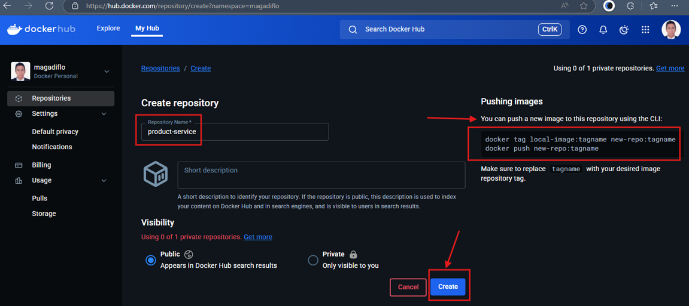
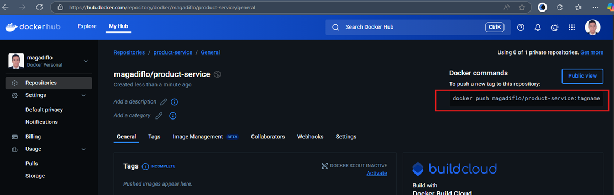
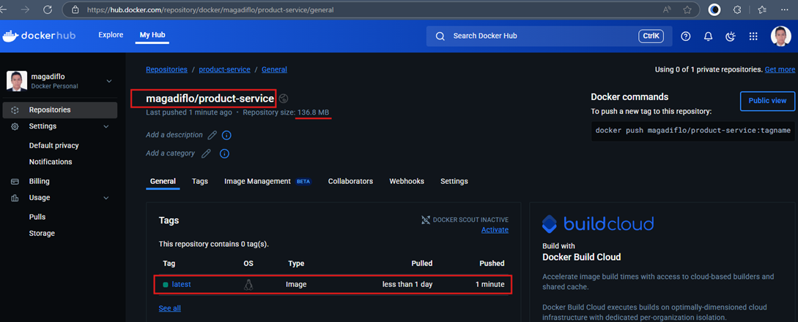

# Sección 13: Docker Hub - Repositorio para compartir imágenes en la nube

---

## Introducción Docker Hub

`Docker Hub` es un registro de imágenes en la nube ofrecido por Docker Inc. que permite `almacenar`, `compartir` y
`administrar` `imágenes de contenedores Docker`. Funciona como un `repositorio centralizado` donde los desarrolladores
pueden subir sus propias imágenes, acceder a imágenes oficiales mantenidas por `Docker`, y buscar imágenes creadas por
la comunidad.

## Creando nuestro repositorio y enviando imagen a Docker Hub con push

Haremos el ejemplo con el microservicio de productos, así que lo primero que haremos será crear en `Docker Hub` un
nuevo repositorio, en nuestro caso llamado `product-service`.



Notar que en el lado derecho nos da comandos que podríamos seguir para subir una imagen.

1. Asignar un nuevo nombre (`repository` y `tag`) a una imagen existente.
   ````bash
   $ docker tag local-image:tagname new-repo:tagname
   ````

2. Subir la imagen a Docker Hub.
   ````bash
   $ docker push new-repo:tagname
   ````

Luego de haber creado el repositorio, en el lado derecho nos muestra el comando exacto que debemos usar para poder subir
la imagen.



Entonces, seguiremos la recomendación de la primera parte para poder renombrar la imagen, luego usaremos el comando
proporcionado para poder subir la imagen a `Docker Hub`.

Listamos todos las imágenes que tenemos.

````bash
$ docker image ls
REPOSITORY             TAG             IMAGE ID       CREATED        SIZE
item-service           latest          6352b1a34aea   5 hours ago    378MB
gateway-server         latest          145c9eccca29   5 hours ago    392MB
authorization-server   latest          cbb25c5093cb   6 hours ago    381MB
user-service           latest          0e34c3fb9672   6 hours ago    430MB
product-service        latest          555a52fa322d   7 hours ago    432MB
config-server          latest          35d17c3a3a38   30 hours ago   366MB
discovery-server       latest          795f529f0235   30 hours ago   391MB
openzipkin/zipkin      3.5.1           bb570eb45c29   5 days ago     379MB
postgres               17-alpine       7062a2109c4b   2 months ago   398MB
mysql                  8.0.41-debian   b2252987e0ec   3 months ago   812MB
````

Asignamos un nuevo nombre a la imagen `product-service` según lo mostrado por `Docker Hub` `magadiflo/product-service`.

````bash
$ docker tag product-service magadiflo/product-service:latest
````

Si listamos nuevamente, vemos la imagen que acabamos de renombrar.

````bash
$ docker image ls
REPOSITORY                  TAG             IMAGE ID       CREATED        SIZE
item-service                latest          6352b1a34aea   5 hours ago    378MB
gateway-server              latest          145c9eccca29   6 hours ago    392MB
authorization-server        latest          cbb25c5093cb   6 hours ago    381MB
user-service                latest          0e34c3fb9672   6 hours ago    430MB
product-service             latest          555a52fa322d   7 hours ago    432MB
magadiflo/product-service   latest          555a52fa322d   7 hours ago    432MB
config-server               latest          35d17c3a3a38   30 hours ago   366MB
discovery-server            latest          795f529f0235   30 hours ago   391MB
openzipkin/zipkin           3.5.1           bb570eb45c29   5 days ago     379MB
postgres                    17-alpine       7062a2109c4b   2 months ago   398MB
mysql                       8.0.41-debian   b2252987e0ec   3 months ago   812MB
````

### Autenticación en Docker Hub desde la terminal

> Antes de poder subir imágenes a `Docker Hub`, es importante autenticarse desde la terminal. Esto garantiza que las
> imágenes se suban a tu cuenta y repositorios personales o de tu organización. Para hacerlo, se utiliza el siguiente
> comando:
>
> `docker login`
>
> Este comando solicita tu nombre de usuario y contraseña (o token de acceso personal). Una vez autenticado, puedes
> subir imágenes con `docker push` a tus repositorios en `Docker Hub`. Sin este paso, los intentos de subida serán
> rechazados por falta de permisos.

Procedemos a subir la imagen.

````bash
$ docker push magadiflo/product-service:latest
The push refers to repository [docker.io/magadiflo/product-service]
cfd61dcb6a3d: Pushed
cda86626eeb3: Pushed
f6cd406c8d97: Pushed
4f4fb700ef54: Pushed
7307df9649e7: Pushed
57ecee2a1e2f: Pushed
74f6a226ed93: Pushed
f18232174bc9: Pushed
edad32b845e4: Pushed
e6744199aa66: Pushed
ecbe45699901: Pushed
latest: digest: sha256:555a52fa322d98a8e1a6e026e61cb823a0b1bbd56b21e640dff168dff342fe48 size: 856
````

Si vamos a `Docker Hub` veremos que nuestra imagen se ha subido correctamente.


